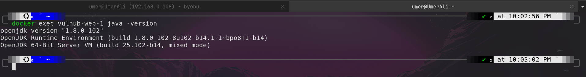
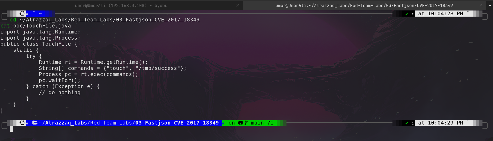
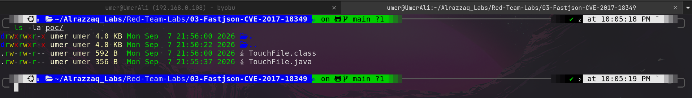
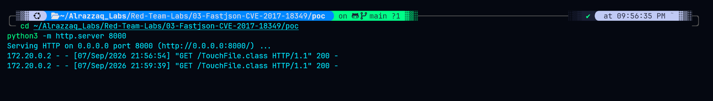
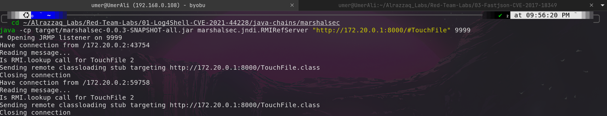
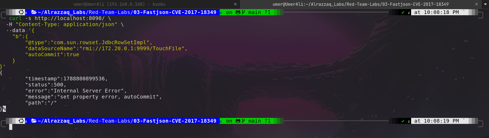
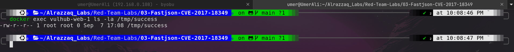

# Fastjson Remote Code Execution — CVE-2017-18349

## Summary

This lab demonstrates remote code execution (RCE) in Alibaba **Fastjson**, exploiting unsafe deserialization via the `@type` polymorphic type-resolution feature (CVE-2017-18349). By passing a crafted JSON payload referencing `com.sun.rowset.JdbcRowSetImpl`, an attacker can force the vulnerable application to perform a JNDI lookup against an attacker-controlled RMI endpoint, which returns a reference to a malicious remotely-loaded Java class. That class executes arbitrary code on the target the moment it is instantiated.

This is the third lab in a series exploring JNDI-injection-based deserialization vulnerabilities:

| Lab | Mechanism | Trigger |
|---|---|---|
| [Log4Shell (CVE-2021-44228)](../01-Log4Shell-CVE-2021-44228) | JNDI via LDAP | Log message formatting |
| [Spring4Shell (CVE-2022-22965)](../02-Spring4Shell-CVE-2022-22965) | Data-binding property override | HTTP parameter → Tomcat log valve |
| **Fastjson (CVE-2017-18349)** | JNDI via RMI | JSON deserialization `@type` polymorphism |

Same root vulnerability class — unsafe deserialization / reflection-driven object instantiation — exploited through three distinct application-layer mechanisms.

## Environment

- **Target:** Vulhub `fastjson` CVE-2017-18349 Docker environment
- **Java version (target):** 8u102 (no `trustURLCodebase` restriction — required for this exploit chain to work)
- **Attack tooling:** [marshalsec](https://github.com/mbechler/marshalsec) (RMI reference server), Python HTTP server, custom PoC class (`TouchFile.java`)
- **Network:** Isolated Docker bridge network, no host mounts
- **Gateway IP:** `172.20.0.1`

## Vulnerability

Fastjson versions ≤ 1.2.47 allow arbitrary class deserialization through the `@type` key in JSON input. When the target class is `com.sun.rowset.JdbcRowSetImpl`, setting its `dataSourceName` property triggers a JNDI lookup using attacker-supplied input — with no validation of the destination. Pointing that lookup at an attacker-controlled RMI server allows remote class loading and immediate code execution via the loaded class's static initializer.

## Result

Confirmed RCE. See [`findings.md`](./findings.md) for full evidence and [`methodology.md`](./methodology.md) for the exploitation walkthrough. Exact commands used are logged in [`commands.md`](./commands.md). Remediation guidance is in [`remediation.md`](./remediation.md).

## Screenshots

Each image below maps to a stage of the exploitation chain, in order.

### 1. Java Version Check

Confirms the target JVM version (8u102) inside the container. This version predates the fix that disabled remote codebase trust by default, which is why the JNDI-based remote classloading step later in the chain is possible.

### 2. Payload Source

Source of the PoC payload class, `TouchFile.java`. Its static initializer runs `touch /tmp/success` — a benign, easily verifiable action used to prove code execution without deploying a functional attack tool.

### 3. Compiled Payload Class

Confirms `TouchFile.class` was compiled (targeting Java 8 bytecode) and sits alongside the source in `poc/`, ready to be served.

### 4. HTTP Server Serving the Class

Terminal 1: the Python HTTP server log showing `GET /TouchFile.class HTTP/1.1" 200`, proving the victim JVM fetched the payload class over the network after the JNDI lookup redirected it here.

### 5. RMI/JNDI Server Log

Terminal 2: marshalsec's RMI reference server log showing it received the JNDI lookup for `TouchFile` and responded with a classloading stub pointing at the HTTP server — the step that hijacks the deserialization flow.

### 6. Exploit Trigger

Terminal 3: the crafted JSON payload sent via `curl`, and the server's response. The `500 / autoCommit` error is expected — it fires *after* the JNDI lookup and remote class load already completed, so it doesn't indicate failure.

### 7. RCE Proof

The definitive proof: `/tmp/success` exists inside the container, owned by `root`, with a timestamp matching the moment the exploit was fired — confirming the static initializer executed.

### 8. Full Chain (optional)

*(If captured)* All three terminals visible together with aligned timestamps, showing the full chain firing as one continuous sequence rather than staged separately.

## Disclaimer

This lab was performed exclusively against an isolated, intentionally vulnerable Docker container (Vulhub) for educational and portfolio purposes. No production systems, third-party infrastructure, or systems outside the attacker's own control were involved.
