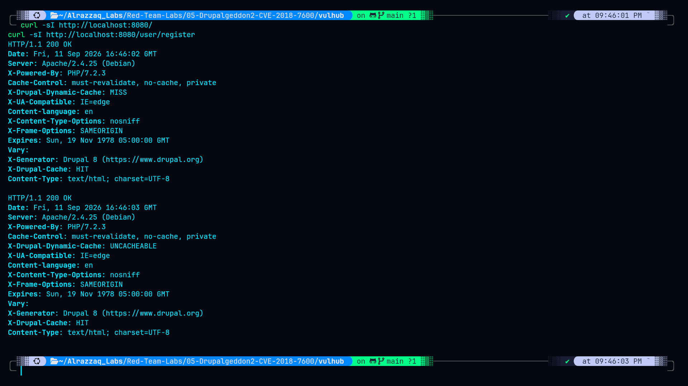
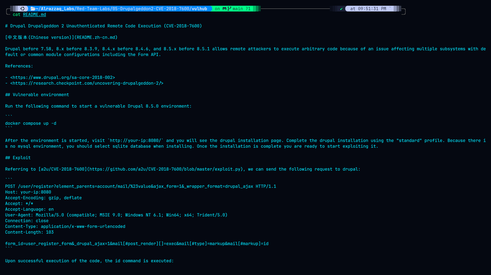
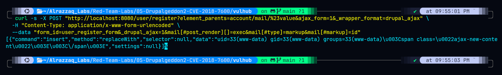
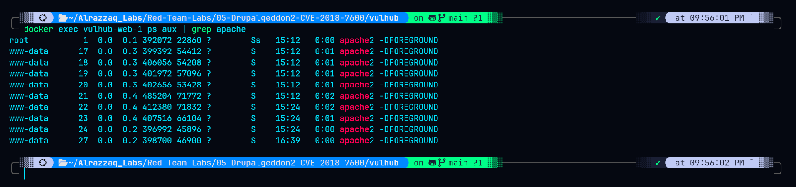

# Lab 05 — Drupalgeddon2 (CVE-2018-7600)

## Overview

| | |
|---|---|
| **CVE** | CVE-2018-7600 |
| **Target** | Drupal 7.x / 8.x |
| **Vulnerability class** | PHP Object Injection / Remote Code Execution via Form API render arrays |
| **Auth required** | No (unauthenticated) |
| **Environment** | Vulhub Docker container |
| **Result** | Remote code execution as `www-data` |

## Summary

Drupal's Form API allows certain renderable array keys (`#post_render`, `#markup`, `#lazy_builder`, etc.) to contain callable PHP functions that are executed during rendering. Prior to the fix for CVE-2018-7600, Drupal failed to properly sanitize renderable arrays built from user-supplied input on several AJAX/REST-exposed endpoints (e.g. `user/register`). This allowed an unauthenticated attacker to smuggle a crafted render array into a request and have Drupal execute arbitrary PHP — including calling `exec()` — with no login required.

This lab reproduces the exploit against a Vulhub container, confirms code execution, and independently verifies the privilege level the RCE actually achieves.

## Lab Structure

```
05-Drupalgeddon2-CVE-2018-7600/
├── commands.md        # Exact commands run, in order
├── findings.md        # What was found and what it proves
├── methodology.md      # How/why each step was performed
├── remediation.md     # Fix guidance
├── screenshots/        # Evidence captures
├── raw-output/         # Saved command output
└── vulhub/             # Vulhub docker-compose environment
```

## Screenshots

### 1. Recon


`curl -I` requests to `/` and `/user/register`, both returning `200 OK`. Confirms the Drupal instance is up and the vulnerable registration endpoint (the AJAX form entry point the exploit targets) is reachable before any payload is sent.

### 2. Vulhub README reference


The Vulhub `README.md` for this CVE, showing the intended PoC reference and expected setup. Included for traceability — proves the lab environment matches the documented, known-vulnerable configuration rather than a custom or modified setup.

### 3. Exploit request and RCE response


The exploit request and the resulting JSON/AJAX response. The response body contains the output of the injected `id` command, demonstrating that arbitrary PHP (and by extension, arbitrary shell commands via `exec()`) executed on the target with no authentication.

### 4. Independent verification


Independent verification step: `docker exec vulhub-web-1 ps aux | grep apache` run against the container, shown *after* the exploit. Confirms the Apache worker processes handling requests run as `www-data`, matching the privilege level reported by the exploit's `id` output — proving the RCE result wasn't a fluke and correctly identifying which process actually executed the payload (as opposed to the root-owned master process or a `docker exec` shell, neither of which reflect the web server's real privilege level).

## Key Finding

RCE achieved as `www-data`, **not** root. Unlike the Struts2 lab in this series (where RCE landed as root immediately), this is a more realistic real-world outcome — an unauthenticated attacker gets a foothold as the low-privileged web server user and would need a separate privilege escalation step to reach root. See `findings.md` for details.

## References

- CVE-2018-7600 — https://nvd.nist.gov/vuln/detail/CVE-2018-7600
- Drupal Security Advisory SA-CORE-2018-002
- Vulhub PoC: `drupal/CVE-2018-7600`
