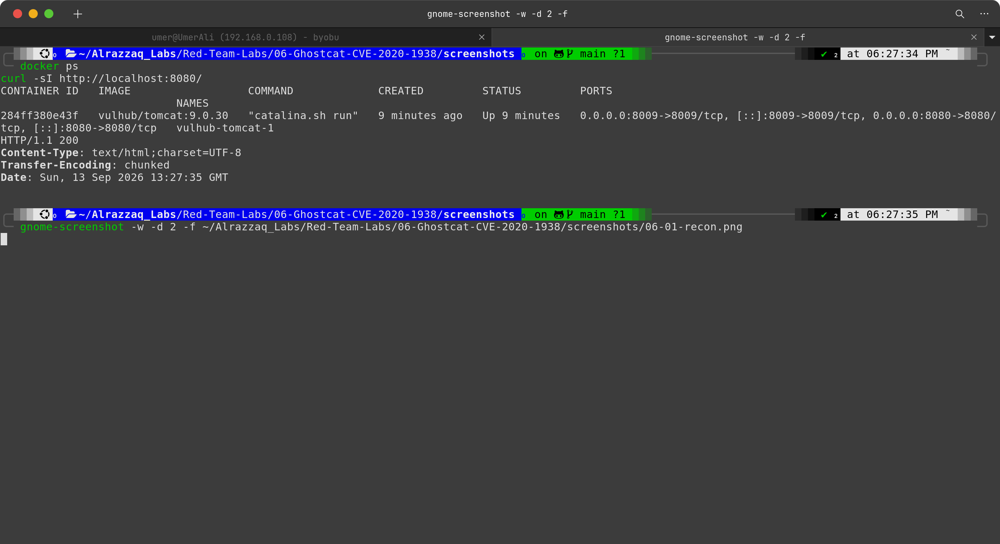
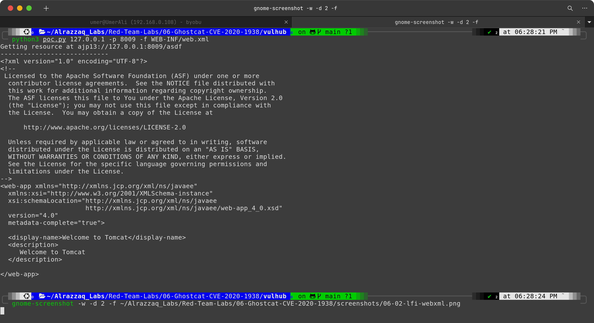
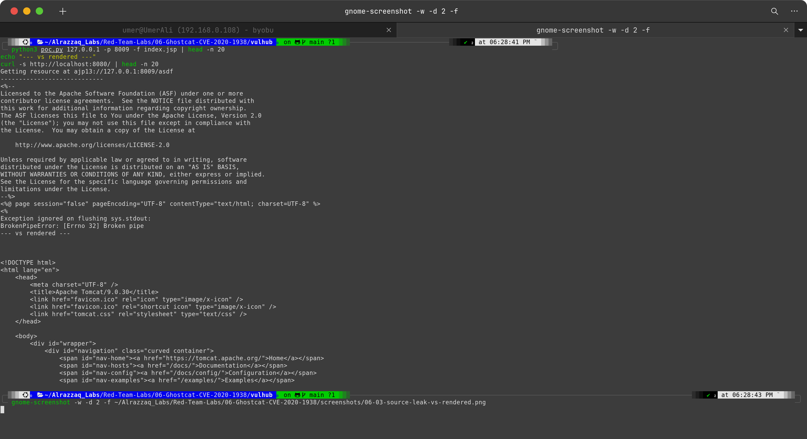
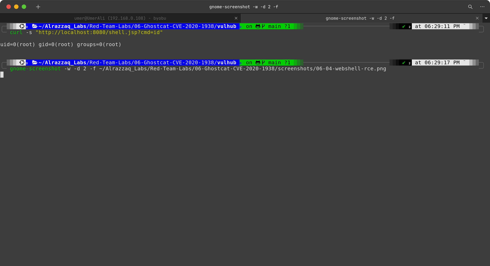
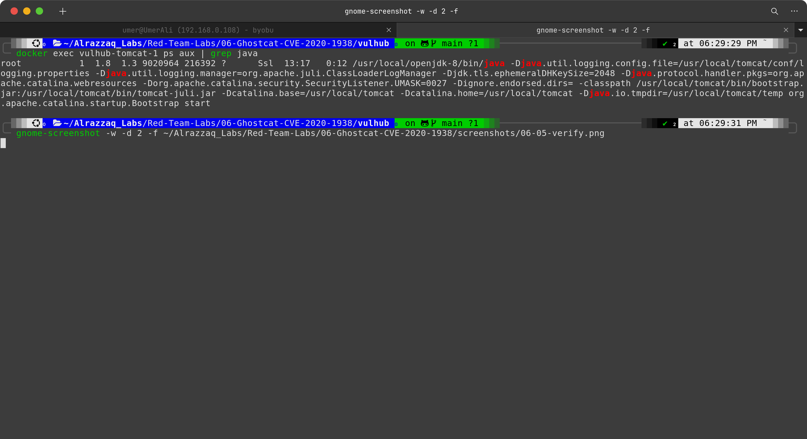

# Lab 06 — Ghostcat (CVE-2020-1938)

## Overview

| | |
|---|---|
| **CVE** | CVE-2020-1938 |
| **Target** | Apache Tomcat 9.0.30 (AJP Connector) |
| **Vulnerability class** | Arbitrary File Read / File Inclusion via AJP protocol |
| **Auth required** | No (unauthenticated) |
| **Environment** | Vulhub Docker container |
| **Result** | Unauthenticated file read within the webapp root; escalated to full RCE as `root` via a simulated file-drop + include chain |

## Summary

Apache Tomcat's AJP connector (port 8009) is designed to be used by a trusted front-end web server (like Apache HTTPD via `mod_jk`), not exposed directly to untrusted clients. Due to a flaw in how Tomcat processed AJP request attributes — specifically `javax.servlet.include.request_uri`, `javax.servlet.include.path_info`, and `javax.servlet.include.servlet_path` — an attacker who can reach the AJP port directly could request that Tomcat *include* and return the raw contents of any file within the webapp root, bypassing the servlet/JSP execution engine entirely. This exposes source code, configuration files, and any other file within the webapp — with no authentication.

If the target application also allows a file to be placed on disk (e.g. via an upload feature), the same AJP `include` mechanism can be used to force Tomcat to execute that file as a JSP, escalating file-read into full remote code execution.

This lab reproduces the file-read primitive against a Vulhub container, demonstrates the impact by contrasting raw JSP source disclosure against normal rendered output, and then simulates the second stage of the attack chain (file placement + execution) to demonstrate RCE.

## Lab Structure

```
06-Ghostcat-CVE-2020-1938/
├── commands.md        # Exact commands run, in order
├── findings.md        # What was found and what it proves
├── methodology.md      # How/why each step was performed
├── remediation.md     # Fix guidance
├── screenshots/        # Evidence captures
├── raw-output/         # Saved command output
├── poc/                # Local webshell source used in stage 2
└── vulhub/             # Vulhub docker-compose environment + poc.py
```

## Screenshots

### 1. Recon


`docker ps` confirming both exposed ports — `8009/tcp` (AJP, the actual attack surface) and `8080/tcp` (HTTP) — followed by a `curl -I` against port 8080 returning `200 OK`. Confirms the target is live and both relevant ports are reachable before any exploit traffic is sent.

### 2. Unauthenticated file read (LFI)


Vulhub's bundled `poc.py` used to speak raw AJP protocol directly to port 8009, requesting `WEB-INF/web.xml` via the `javax.servlet.include.path_info` attribute. The full, unauthenticated file contents are returned — proving the arbitrary file read primitive.

### 3. Source disclosure vs. rendered output


Side-by-side proof of impact: the same `index.jsp` requested two ways. Via Ghostcat (`poc.py -f index.jsp`), Tomcat returns the **raw, unexecuted JSP source** — visible `<%@ page %>` directives, raw Java, and unresolved `${...}` expression-language tags. Via a normal HTTP request to `/`, Tomcat executes the JSP and returns fully rendered HTML with no server-side code visible. This demonstrates that Ghostcat bypasses the servlet engine's execution step entirely, which in a real application would leak hardcoded credentials, internal logic, or configuration embedded in JSP source.

### 4. Simulated RCE via webshell


A minimal JSP webshell (`poc/shell.jsp`) was placed directly into the container's webapp root (simulating a file having been placed there via some other vector, such as an upload feature) and then requested normally over HTTP with a `cmd` parameter. The response shows `uid=0(root)`, confirming remote code execution.

### 5. Independent verification


`docker exec vulhub-tomcat-1 ps aux | grep java` run after the webshell request, showing the actual Tomcat/Java process (PID 1) running as `root` — matching the webshell's own `id`/`whoami` output. Because Tomcat runs as a single process (unlike Apache's multi-worker model in the Drupal lab), this is a direct, unambiguous cross-check with no root-vs-worker distinction to account for.

## Key Findings

1. **Unauthenticated arbitrary file read**, scoped to the webapp root (not full filesystem — a `../` traversal attempt out of the webapp root was blocked by Tomcat's own path normalization).
2. **Source code disclosure**: raw JSP source (including any hardcoded secrets a real app might contain) is exposed instead of rendered output.
3. **RCE achievable** when combined with any file-write primitive, since AJP `include` will execute `.jsp` files placed on disk. In this container, that step was simulated directly (`docker cp`) rather than through a real upload endpoint, since this target has no upload feature — this is documented explicitly in `findings.md` rather than overstated.
4. **Full root** achieved in this container — a more severe outcome than the Drupal lab (`www-data`), and consistent with the Struts2 lab's outcome, since this Tomcat container runs its Java process as root.

## References

- CVE-2020-1938 — https://nvd.nist.gov/vuln/detail/CVE-2020-1938
- Chaitin Tech Ghostcat writeup — https://www.chaitin.cn/en/ghostcat
- Vulhub PoC: `tomcat/CVE-2020-1938`
