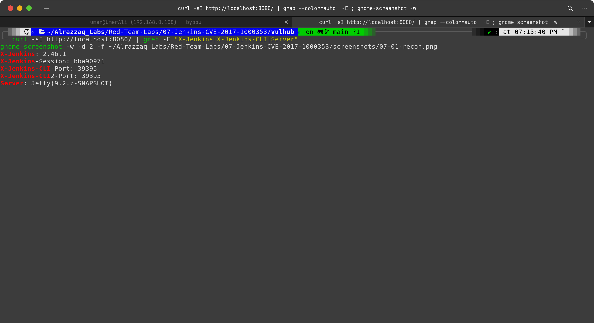
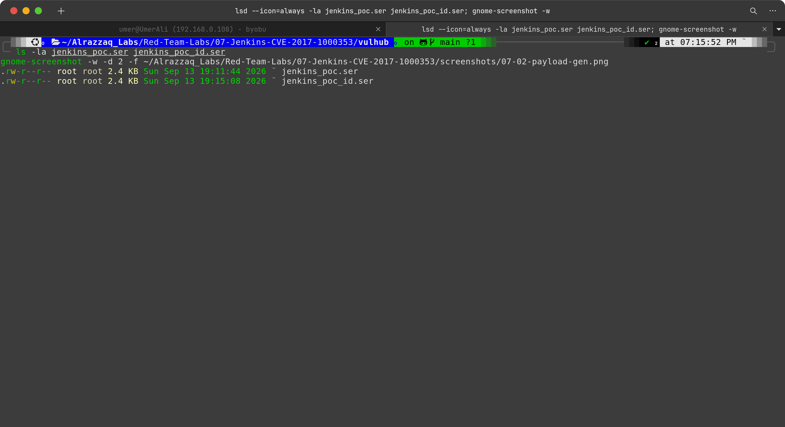
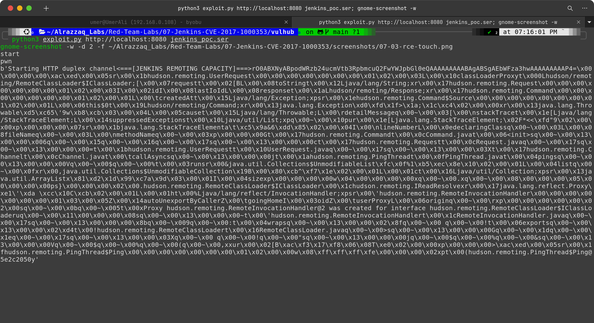
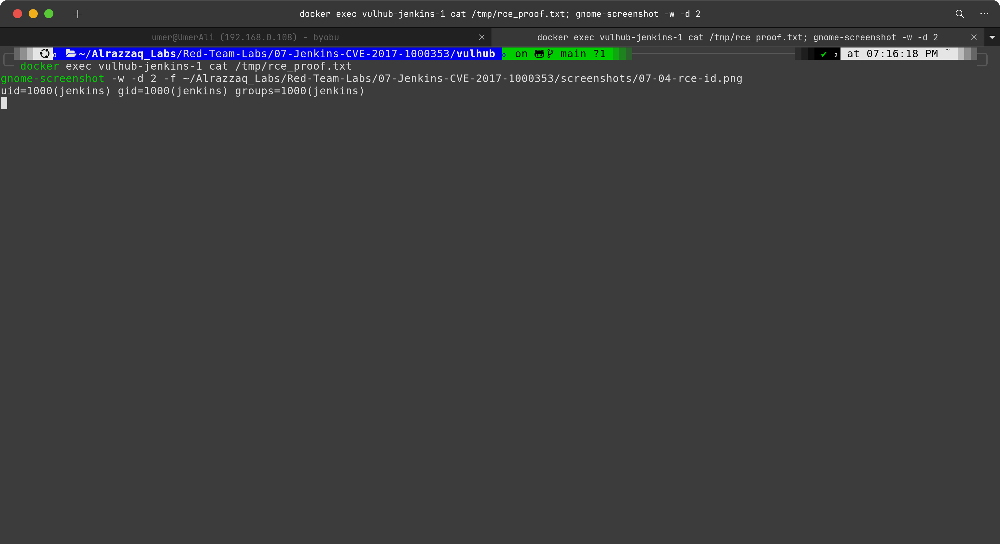
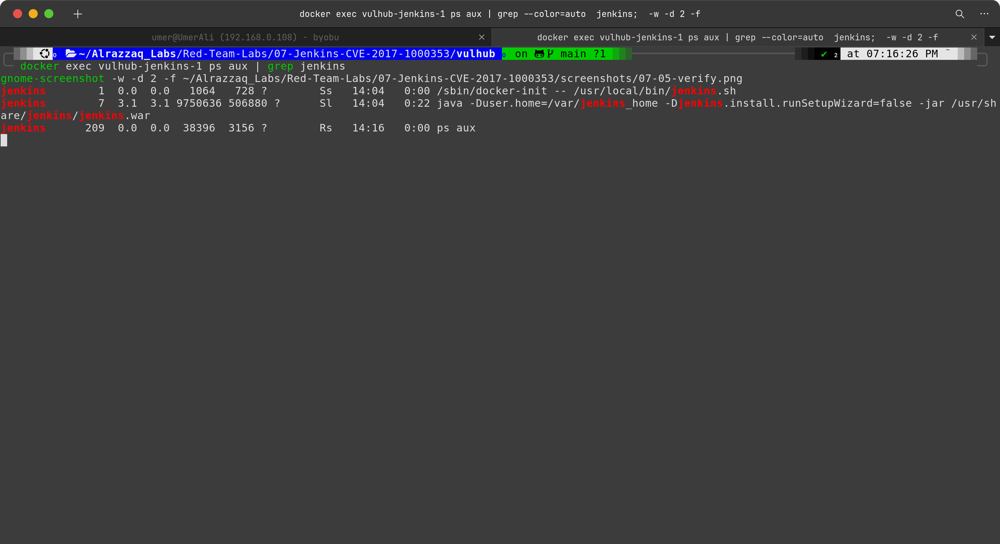

# Lab 07 — Jenkins RCE (CVE-2017-1000353)

## Overview

| | |
|---|---|
| **CVE** | CVE-2017-1000353 |
| **Target** | Jenkins 2.46.1 LTS |
| **Vulnerability class** | Java Deserialization RCE via CLI Remoting Protocol |
| **Auth required** | No (unauthenticated) |
| **Environment** | Vulhub Docker container |
| **Result** | Remote code execution as `jenkins` (uid=1000) |

## Summary

Jenkins exposes a CLI interface over HTTP using a custom remoting protocol. In versions 2.56 and earlier (and 2.46.1 LTS and earlier), Jenkins accepted serialized Java objects transmitted via the CLI endpoint — and deserialized them using a raw `ObjectInputStream` **before performing any authentication check**. By crafting a malicious serialized Java payload using a known gadget chain (a sequence of existing Java classes whose method calls chain together to reach `Runtime.exec()`), an attacker with network access to the Jenkins HTTP port could achieve unauthenticated remote code execution.

This lab reproduces the full attack chain: generating a malicious serialized payload, delivering it to the vulnerable CLI endpoint, and confirming code execution on the target server.

## How this differs from earlier labs in this series

This vulnerability shares the same **class** of bug as Log4Shell and Fastjson (unsafe Java deserialization), but differs in two important ways:

- **Delivery mechanism**: the payload is delivered over Jenkins' custom HTTP-based CLI remoting protocol, not via a log message or a JSON field.
- **Bypass mechanism**: Jenkins had an existing deserialization blacklist, but the payload used a `SignedObject` wrapper to pass a secondary deserialized object through a fresh `ObjectInputStream` that didn't apply the blacklist — a classic blacklist-bypass technique worth noting explicitly.

## Lab Structure

```
07-Jenkins-CVE-2017-1000353/
├── commands.md        # Exact commands run, in order
├── findings.md        # What was found and what it proves
├── methodology.md      # How/why each step was performed
├── remediation.md     # Fix guidance
├── screenshots/        # Evidence captures
├── raw-output/         # Saved command output
└── vulhub/             # Vulhub docker-compose environment + tools
    ├── CVE-2017-1000353-1.1-SNAPSHOT-all.jar  # Payload generator
    ├── exploit.py                               # Delivery script
    ├── jenkins_poc.ser                          # Payload: touch /tmp/success
    └── jenkins_poc_id.ser                       # Payload: sh /tmp/idscript.sh
```

## Screenshots

### 1. Recon — version and CLI port fingerprinting


`curl -sI http://localhost:8080/` against the Jenkins HTTP interface. Key headers visible: `X-Jenkins: 2.46.1` (confirming the vulnerable version) and `X-Jenkins-CLI-Port` (the dynamically assigned port Jenkins advertises for CLI remoting — this is the actual protocol port the exploit sends its payload to, not port 8080 itself). No authentication was required to retrieve these headers.

### 2. Payload generation


Two serialized Java payload files generated using Vulhub's `CVE-2017-1000353-1.1-SNAPSHOT-all.jar` tool running in a pinned OpenJDK 8u292 Docker container (the README explicitly warns that other Java versions can produce silently broken payloads). `jenkins_poc.ser` encodes `touch /tmp/success`; `jenkins_poc_id.ser` encodes `sh /tmp/idscript.sh` (a pre-placed script running `id > /tmp/rce_proof.txt`). The use of a pre-placed script for the second payload is a direct consequence of `Runtime.exec()` not invoking a shell — documented in `findings.md`.

### 3. Initial RCE — exploit delivery


`exploit.py` delivering the serialized payload to the Jenkins CLI endpoint over HTTP. The script reads the CLI port from the `X-Jenkins-CLI-Port` response header automatically, establishes the remoting protocol handshake (the `JENKINS REMOTING CAPACITY` preamble), and transmits the malicious serialized object. The server deserializes it — triggering the gadget chain — with no authentication challenge at any point.

### 4. RCE confirmed — identity capture


`docker exec vulhub-jenkins-1 cat /tmp/rce_proof.txt` showing `uid=1000(jenkins) gid=1000(jenkins) groups=1000(jenkins)` — the output of `id` written to disk by the deserialized payload executing server-side. Proves that arbitrary shell commands were executed on the target as the `jenkins` user, with no authentication.

### 5. Independent verification


`docker exec vulhub-jenkins-1 ps aux | grep jenkins` confirming the actual running Jenkins/Java process (PID 7) runs as `jenkins` — matching the `id` output from the RCE proof file exactly, and independently proving which process executed the payload.

## Key Findings

1. **Unauthenticated RCE** via the Jenkins CLI remoting endpoint — no credentials, session, or CSRF token required.
2. **Blacklist bypass**: Jenkins had a deserialization blacklist in place, but the `SignedObject` wrapper technique used by this payload caused the inner object to be deserialized by a fresh, unprotected `ObjectInputStream`, completely bypassing it.
3. **Execution context**: `jenkins` user (uid=1000), not root — a more restrictive outcome than the Tomcat lab, but still a full compromise from an attacker's standpoint since the Jenkins user has read access to all pipeline configurations, credentials, secrets, and build artifacts stored on the server.
4. **Java version sensitivity**: payload generation is sensitive to the JDK version used. The OpenJDK 8u292 Docker image was required to produce a working payload; other versions may silently produce broken serialized objects.

## References

- CVE-2017-1000353 — https://nvd.nist.gov/vuln/detail/CVE-2017-1000353
- Jenkins Security Advisory SA-2017-04-26 — https://www.jenkins.io/security/advisory/2017-04-26/
- Exploit-DB #41965 — https://www.exploit-db.com/exploits/41965
- Vulhub PoC: `jenkins/CVE-2017-1000353`
