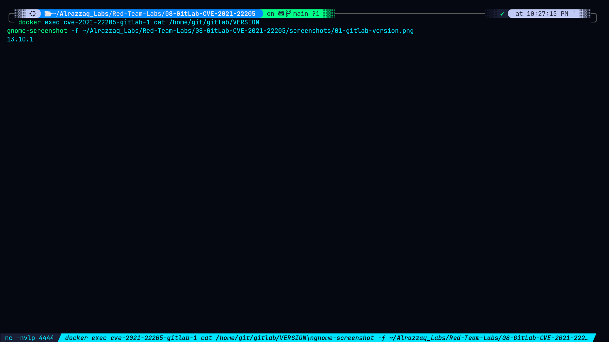
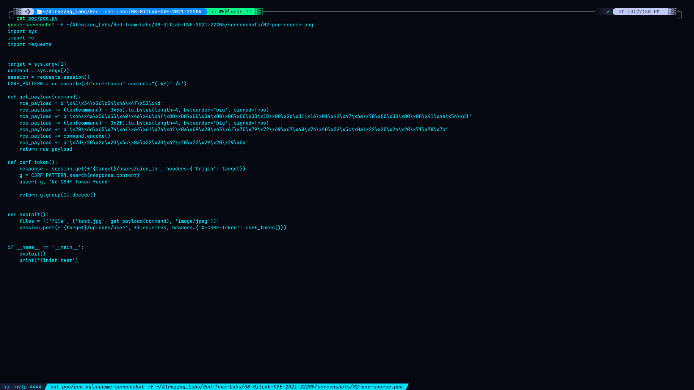
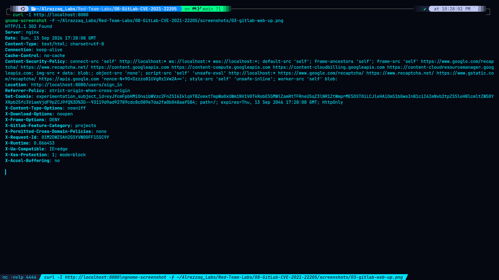
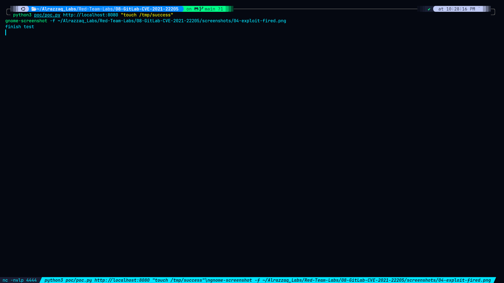
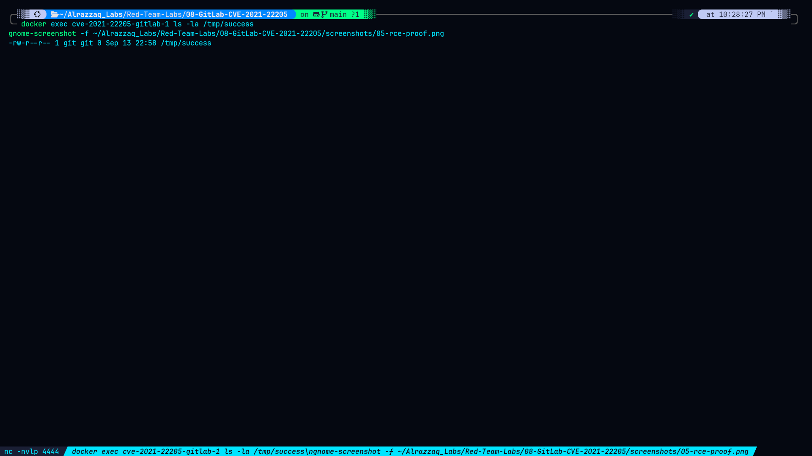
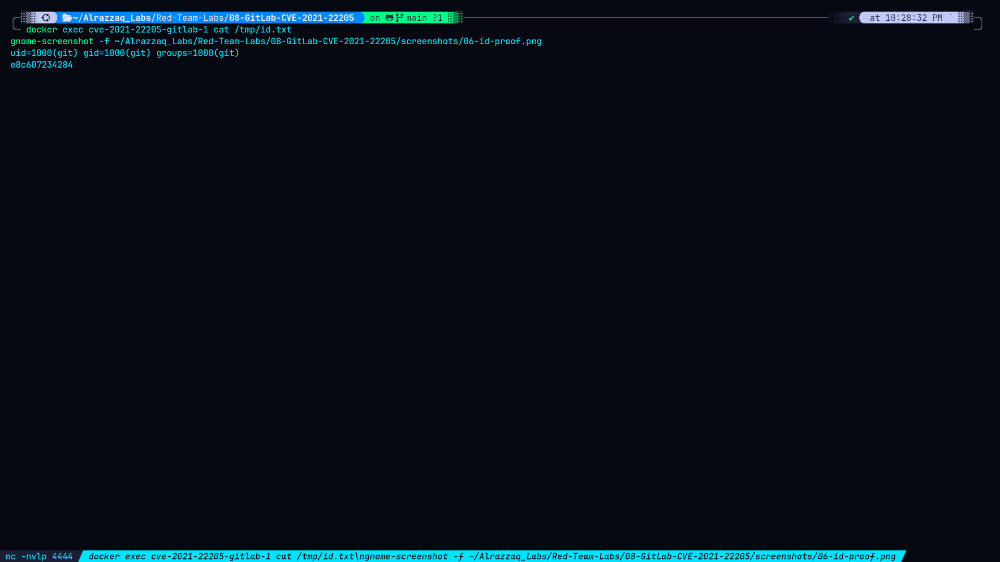

# GitLab Pre-Auth Remote Code Execution — CVE-2021-22205

## Summary

This lab demonstrates an unauthenticated remote code execution vulnerability in **GitLab Community/Enterprise Edition** (versions 11.9 through 13.10.2), exploiting a flaw in how GitLab Workhorse passes uploaded image files to **ExifTool** for metadata stripping. By uploading a specially crafted DjVu file with an injected Perl payload in its metadata, an attacker can execute arbitrary commands on the GitLab server — with **no authentication required**.

The underlying ExifTool flaw is tracked as **CVE-2021-22204**; GitLab's exposure of the unauthenticated upload endpoint that triggers it is **CVE-2021-22205**. GitLab initially classified this as authenticated (CVSS 9.9) before revising it to unauthenticated in September 2021, raising the score to a perfect **10.0**.

## How It Differs From Previous Labs

| Lab | Mechanism | Auth Required | Terminals Needed |
|---|---|---|---|
| Log4Shell (CVE-2021-44228) | JNDI via LDAP | None | 3 |
| Spring4Shell (CVE-2022-22965) | Data-binding override | None | 1 |
| Fastjson (CVE-2017-18349) | JNDI via RMI | None | 3 |
| **GitLab (CVE-2021-22205)** | File upload → ExifTool metadata parsing | **None** | **1** |

This is the simplest exploit chain in the portfolio — a single HTTP POST request is all it takes.

## Environment

- **Target:** Vulhub `gitlab` CVE-2021-22205 Docker environment (GitLab CE 13.10.1)
- **Attack tooling:** Vulhub's `poc.py` (Python, single script)
- **Network:** Isolated Docker bridge, no host mounts
- **Service port:** `8080` (mapped to container's port 80)

## Vulnerability

GitLab's `/uploads/user` endpoint accepts image file uploads **without authentication**. GitLab Workhorse passes these files to ExifTool to strip metadata before storage. ExifTool's DjVu file parser improperly evaluates Perl expressions embedded in DjVu metadata — meaning an attacker can inject arbitrary Perl (and therefore arbitrary OS commands) into a crafted image file and have them executed server-side the moment ExifTool parses the upload.

## Result

Confirmed unauthenticated RCE as the `git` service user (`uid=1000`). See [`findings.md`](./findings.md) for full evidence, [`methodology.md`](./methodology.md) for the exploitation walkthrough, [`commands.md`](./commands.md) for all commands used, and [`remediation.md`](./remediation.md) for fixes.

## Screenshots

### 1. GitLab Version Confirmed

Confirms the target is GitLab CE 13.10.1 — within the vulnerable range (11.9 through 13.10.2). This establishes the exploitable target before any attack is attempted.

### 2. PoC Script Source

The Vulhub-provided `poc.py` script. It fetches a CSRF token from `/users/sign_in`, constructs a malicious DjVu image with the attacker's command injected into its metadata, and uploads it to `/uploads/user` — all in one HTTP session. No authentication token or credentials are passed.

### 3. GitLab Web UI Up (302 Redirect)

`curl -I` showing `HTTP/1.1 302 Found` redirecting to `/users/sign_in` — confirms GitLab is fully initialized and serving requests. Also confirms the attacker has no credentials and is accessing the instance as an unauthenticated user.

### 4. Exploit Fired

`poc.py` running against the target, outputting `finish test` — the script's success indicator confirming the malicious upload was accepted and processed by GitLab Workhorse/ExifTool.

### 5. RCE Proof — File Created

`/tmp/success` exists inside the GitLab container with a fresh timestamp and `git` ownership — proving the injected command (`touch /tmp/success`) executed server-side as the GitLab service user.

### 6. Identity Proof — id + hostname

`/tmp/id.txt` contains `uid=1000(git) gid=1000(git) groups=1000(git)` and the container hostname — confirming the attacker controlled what command ran, what user it ran as, and on which host. This goes beyond mere file creation to demonstrate full command execution control.

### 7. GitLab Browser UI

The GitLab CE 13.10.1 login page loaded in a browser — showing the fully initialized instance that was exploited. Reinforces the real-world nature of the target: a fully running GitLab server, not a stripped-down mock.

## Disclaimer

This lab was performed exclusively against an isolated, intentionally vulnerable Docker container (Vulhub) for educational and portfolio purposes. No production systems, third-party infrastructure, or systems outside the attacker's own control were involved.
