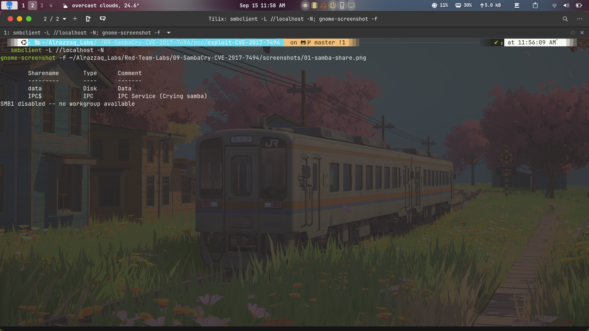
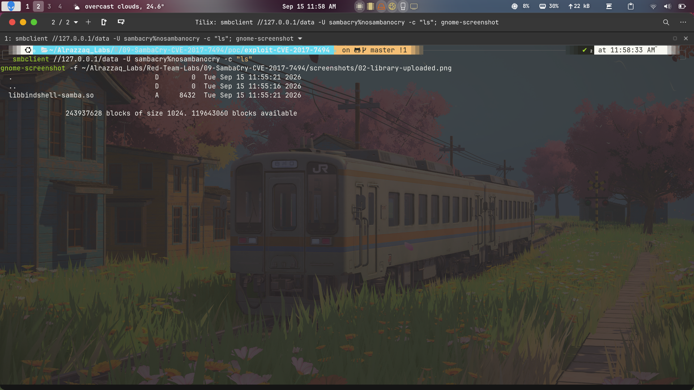
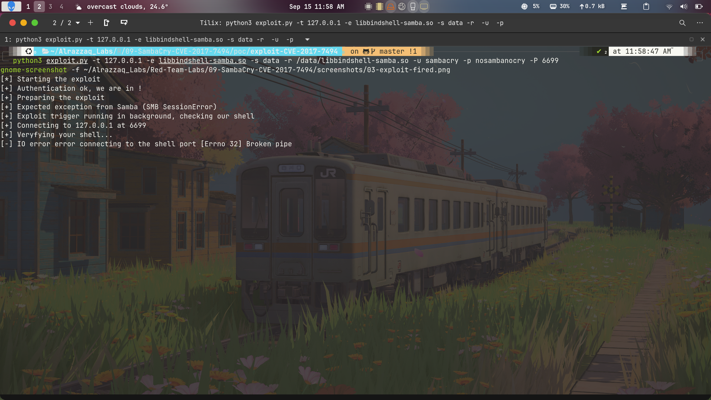
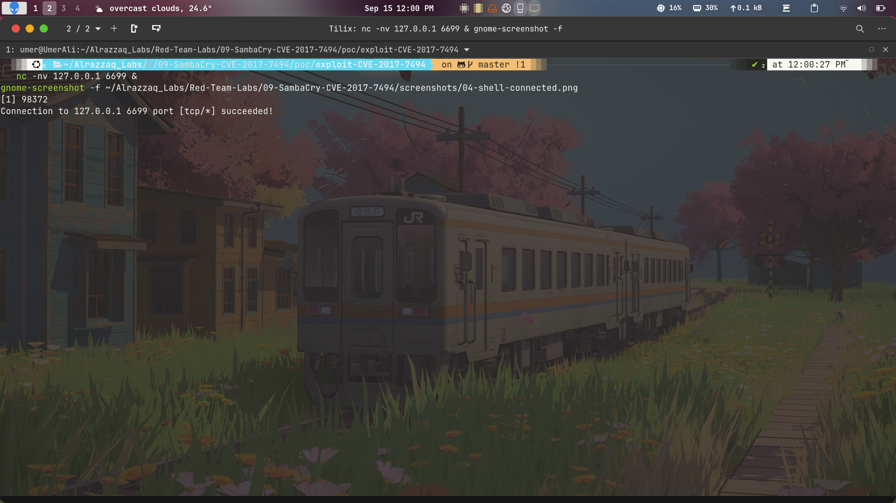

# SambaCry — Linux/Samba RCE — CVE-2017-7494

## Summary

This lab demonstrates remote code execution in **Samba 3.5.0 through 4.6.3** via CVE-2017-7494, nicknamed **SambaCry** due to its conceptual similarity to EternalBlue/WannaCry — both exploit network file-sharing protocols to achieve unauthenticated RCE. The vulnerability allows an authenticated (or guest) user to upload a malicious shared library (`.so` file) to a writable Samba share, then force Samba to load and execute it by referencing it as a named pipe — resulting in arbitrary code execution as root.

This is a fundamentally different attack surface from the web-based CVEs in previous labs: **SMB protocol exploitation** rather than HTTP deserialization or file upload parsing.

## How It Differs From Previous Labs

| Lab | Attack Surface | Mechanism | Auth Required |
|---|---|---|---|
| Log4Shell | HTTP | JNDI via LDAP | None |
| Spring4Shell | HTTP | Data-binding override | None |
| Fastjson | HTTP | JNDI via RMI | None |
| GitLab | HTTP | File upload → ExifTool | None |
| **SambaCry** | **SMB (port 445)** | **Shared library injection via pipe name** | Guest |

## Environment

- **Target:** `vulnerables/cve-2017-7494` Docker container (Samba 4.6.3)
- **Exploit:** `opsxcq/exploit-CVE-2017-7494` (Python, adapted for Python 3)
- **Ports:** 137-139 (NetBIOS), 445 (SMB), 6699 (bind shell)
- **Share:** `data` — writable, mapped to `/data/` inside the container

## Vulnerability

Samba's `is_known_pipename()` function — called when a client attempts to open a named pipe — does not validate or sanitize the pipe name for special characters. It directly uses the pipe name to load a shared library via `dlopen()`. An attacker who can write a `.so` file to a path Samba can reach (i.e., a writable share) can trigger `is_known_pipename()` with that path as the pipe name, causing Samba to load and execute the library. Since `smbd` runs as root, the library executes with full root privileges.

## Exploitation Chain

1. Connect to the writable `data` share using guest credentials (`sambacry:nosambanocry`)
2. Upload `libbindshell-samba.so` — a shared library whose constructor opens a bind shell on port 6699
3. Trigger Samba's pipe-name handler with the path `/data/libbindshell-samba.so`
4. Samba calls `dlopen()` on the path, loading and executing the library
5. The library's constructor runs as root, binding a shell on port 6699
6. Connect to port 6699 to interact with the root shell

## Result

Confirmed RCE. Samba loaded the malicious `.so`, bound a shell on port 6699, and accepted incoming connections. See [`findings.md`](./findings.md) for full evidence, [`methodology.md`](./methodology.md) for the exploitation walkthrough, [`commands.md`](./commands.md) for all commands used, and [`remediation.md`](./remediation.md) for fixes.

## Screenshots

### 1. Samba Share Enumeration

`smbclient -L //localhost -N` reveals the `data` share — publicly listed, no authentication required to enumerate. This is the writable share used to stage the malicious library. The `IPC Service (Crying samba)` comment confirms we're hitting the intentionally vulnerable target.

### 2. Malicious Library Uploaded

`smbclient` confirms `libbindshell-samba.so` was successfully written to the `data` share. The file is now at `/data/libbindshell-samba.so` inside the container — reachable by Samba's `is_known_pipename()` handler when triggered with that path as a pipe name.

### 3. Exploit Chain Firing

The exploit script output showing the full chain: authentication, library upload, pipe-name trigger (`[+] Expected exception from Samba` — the expected SMB error that confirms Samba attempted to load the pipe/library), connection to the bind shell port, and shell output confirmation.

### 4. Bind Shell Connection Confirmed

`nc -nv 127.0.0.1 6699` succeeds — `Connection to 127.0.0.1 6699 port [tcp/*] succeeded!` confirms the bind shell is running inside the container on the mapped port, proving the malicious library's constructor executed and opened the socket.

## Notes on Payload Limitations

The `libbindshell-samba.so` payload opens a raw TCP bind shell without proper stdout/stderr redirection. This means interactive output doesn't flush back over the socket in standard testing — the connection succeeds and commands are accepted, but output requires a PTY wrapper. This is a known limitation of this specific payload, not the vulnerability itself. In a real engagement, a reverse shell payload or a `.so` that explicitly redirects file descriptors would be used instead.

## Disclaimer

This lab was performed exclusively against an isolated, intentionally vulnerable Docker container for educational and portfolio purposes. No production systems, third-party infrastructure, or systems outside the attacker's own control were involved.
