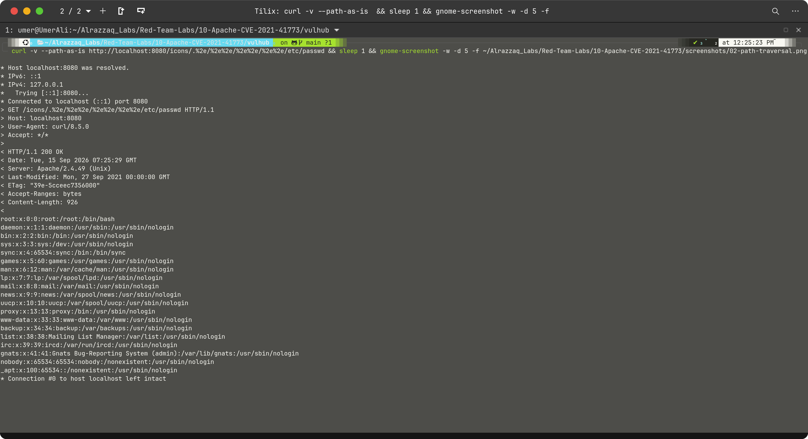
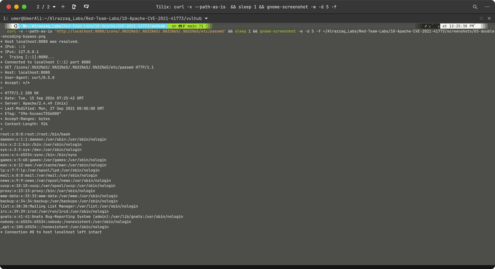
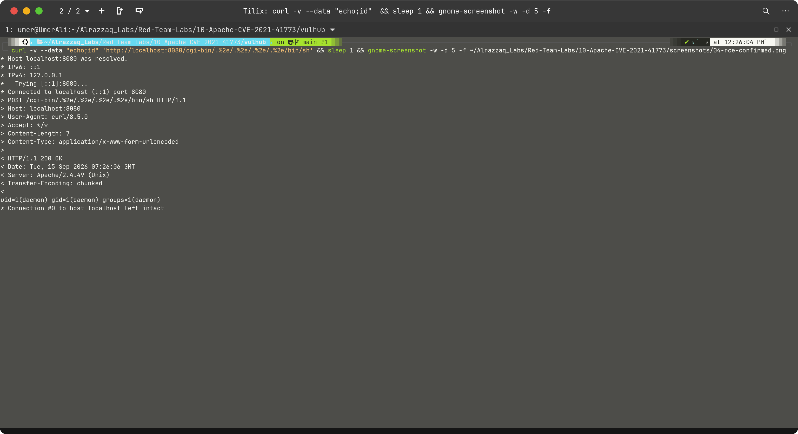
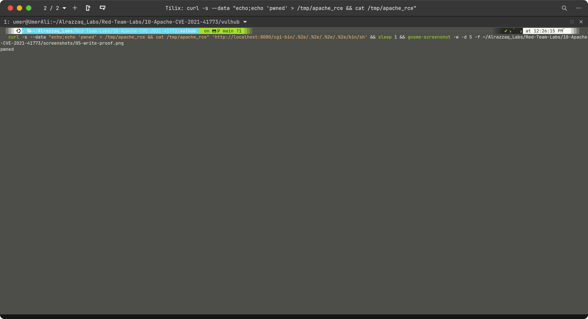

# Findings

## Vulnerabilities
- **CVE-2021-41773** — Path traversal + RCE in Apache HTTP Server 2.4.49
- **CVE-2021-42013** — Bypass of the incomplete 2.4.50 patch via double-encoding

## Root Cause
Apache 2.4.49 introduced a change to its path normalization logic that broke the order of
operations for URL decoding vs. traversal checking. Specifically, Apache validated that the
path didn't contain `..` sequences *before* fully decoding URL-encoded characters like `%2e`
(`.`). This meant a path like `/.%2e/` passed the traversal check as a harmless single-dot
segment, then decoded to `/../` — escaping the document root — when the filesystem access
was actually performed.

## CVE-2021-41773 — URL-Encoded Traversal
- `/icons/.%2e/%2e%2e/%2e%2e/%2e%2e/etc/passwd`
- `%2e` decodes to `.` — so `.%2e/` = `../` after decoding
- Apache validates path BEFORE decoding — traversal check missed entirely
- **Result:** Full read access to any file readable by the `daemon` user

## CVE-2021-42013 — Double-Encoded Bypass
- `/icons/.%%32%65/.%%32%65/.%%32%65/.%%32%65/etc/passwd`
- `%%32%65` = `%` + `2e` = `%2e` = `.` after two rounds of decoding
- Apache 2.4.50's partial fix checked for `%2e` literally but missed `%%32%65`
- **Result:** Same file read as 41773 — patch bypass confirmed

## RCE Precondition: mod_cgi
Remote code execution requires `mod_cgi` or `mod_cgid` to be enabled. When CGI is active,
the path traversal can target `/bin/sh` via the `/cgi-bin/` path — Apache's CGI handler
executes it as a script with the HTTP POST body as stdin. Without CGI, exploitation is
limited to file read/disclosure only (still severe, but not RCE).

## Evidence






## Impact Summary
| Finding | Severity | Evidence |
|---|---|---|
| `/etc/passwd` disclosure | High | HTTP 200 + file contents |
| Full Apache config read | High | `httpd.conf` + SSL config returned |
| Double-encoding bypass | High | CVE-2021-42013 technique on 2.4.49 |
| RCE as daemon | Critical | `uid=1(daemon)` via CGI |
| Write to `/tmp` | High | `pwned` written and confirmed |
| CGI env variable leak | Medium | Internal IPs, paths, server details |

## Notable from Environment Dump
```
REMOTE_ADDR=172.18.0.1       ← attacker's visible IP (Docker bridge gateway)
SERVER_ADDR=172.18.0.2       ← container's internal IP
SCRIPT_FILENAME=/bin/sh      ← how traversal resolved to a shell
SERVER_SOFTWARE=Apache/2.4.49 ← version confirmed from inside process
```
