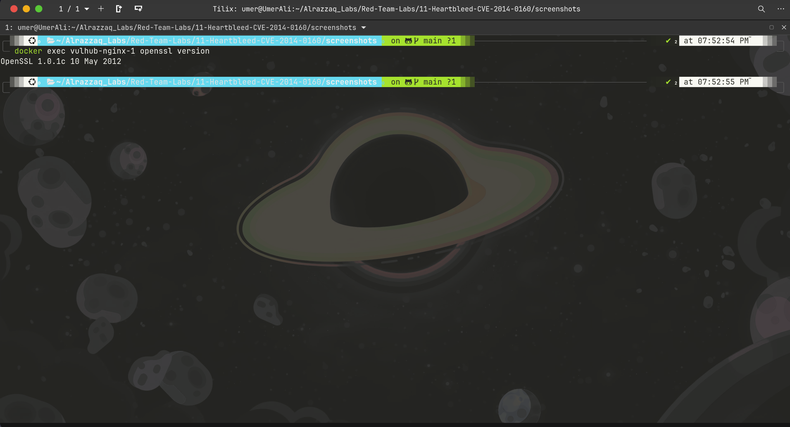
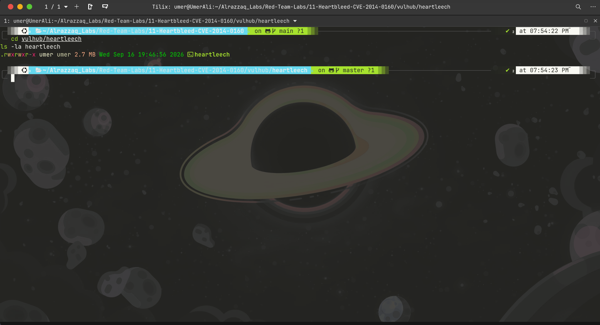
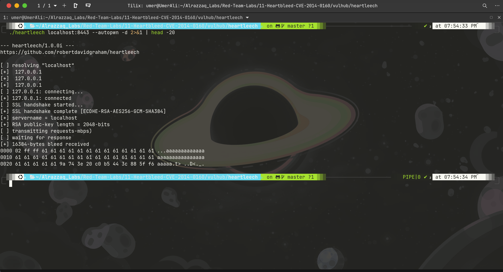
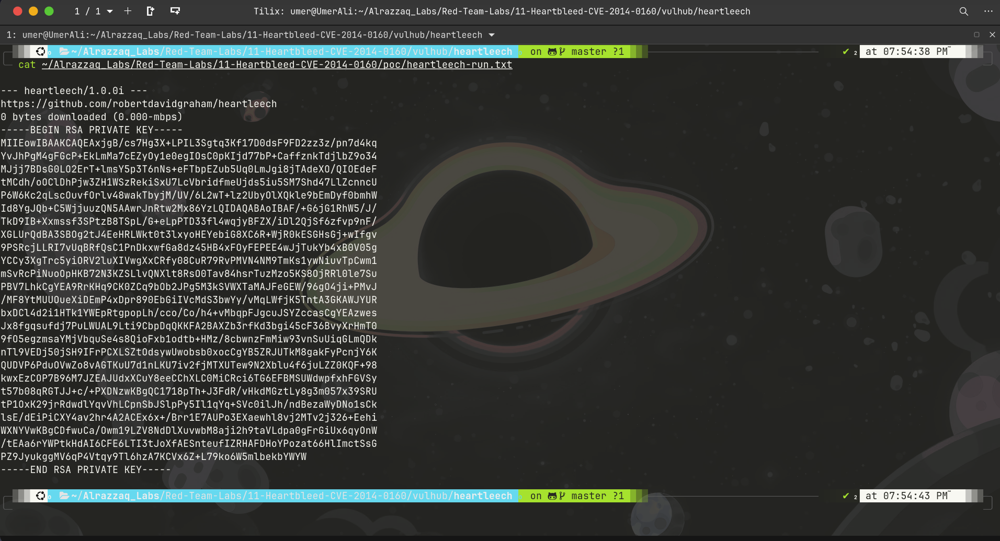
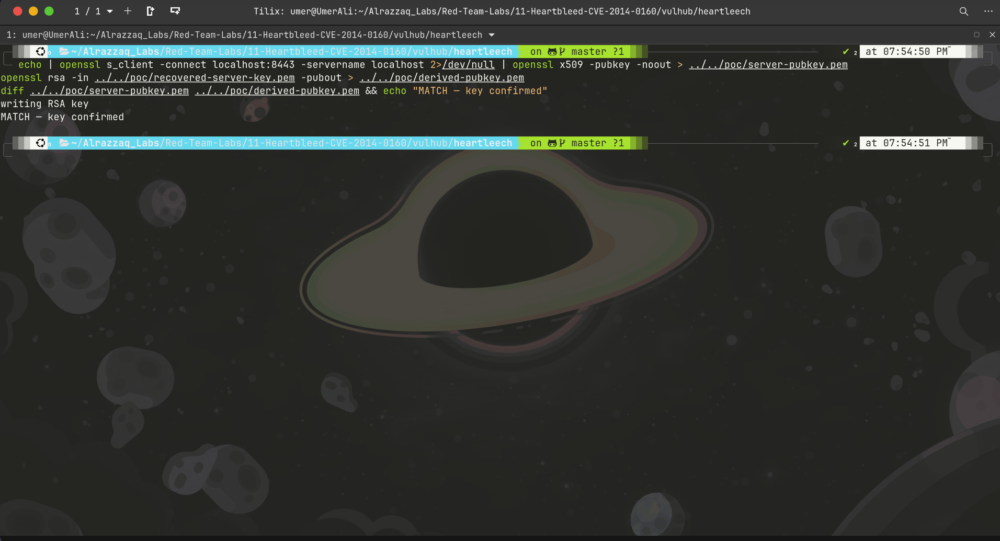

# Lab 11 — Heartbleed (CVE-2014-0160)

## Summary
OpenSSL versions 1.0.1 through 1.0.1f fail to validate the payload length
field in TLS heartbeat requests, allowing an attacker to request up to 64KB
of memory be echoed back from the server's heap — leaking whatever resides
there: session tokens, request fragments, and, with enough repeated bleeding,
the server's own RSA private key.

This lab progresses through three stages: confirming the vulnerability,
leaking in-memory session data from another connection, and finally
recovering the server's live RSA private key.

## Environment
| Component  | Value                              |
|------------|-------------------------------------|
| Target     | vulhub/openssl:1.0.1c-with-nginx    |
| HTTPS port | 8443 (attack surface)               |
| PoC tools  | ssltest.py (Stafford), heartleech (Graham) |

## Stage 1 — Confirm vulnerability

*Target confirmed running OpenSSL 1.0.1c (10 May 2012) — squarely in the
vulnerable range (1.0.1–1.0.1f). This is the exact build with the unpatched
heartbeat handler.*

## Stage 2 — In-memory session data leak

Using `ssltest.py`, repeated heartbeat requests against the live server
leaked another connection's raw HTTP request — including its session
cookie — directly out of the nginx worker's heap:

Recovered plaintext: `GET / HTTP/1.1 | Host: localhost | Cookie: session=SUPERSECRET_SESSION_TOKEN_ALRAZZAQ`

Full hex dumps and methodology for this stage are in [findings.md](findings.md).

## Stage 3 — RSA private key recovery (extended attack)

Standard bleeding proves the bug and can catch opportunistic data, but the
real severity of Heartbleed comes from private key recovery — full
compromise of the server's TLS identity. This requires sustained,
high-volume bleeding scanned for RSA key structure, done here with
[heartleech](https://github.com/robertdavidgraham/heartleech).

### Build success

*heartleech compiled successfully after resolving OpenSSL 3.0 header
incompatibility (built a vendored static OpenSSL 1.0.2u to satisfy
heartleech's legacy struct-access code) and a link-order issue (source must
precede `-lssl -lcrypto` on the linker command line for static libraries).*

### Attack execution

*`heartleech --autopwn` establishes a TLS handshake, fingerprints the
target's 2048-bit RSA public key, then begins continuous heartbeat
requests, scanning every returned bleed for matching private-key structure
in the heap.*

### Private key recovered

*Full 2048-bit RSA private key extracted directly from server memory via
repeated heartbeat bleeding. Key material redacted in this screenshot —
full PEM retained locally in `poc/recovered-server-key.pem` (untracked,
not committed) given its sensitivity.*

### Verification — proving it's the real server key

*The public key derived from the recovered private key was diffed against
the server's actual live certificate public key — byte-for-byte match.
This confirms the recovered key is not coincidental noise but the server's
genuine, currently-active TLS private key.*

## Impact
- **CVSS 3.x: 7.5 (High)** for the base vulnerability; private key
  recovery in this lab demonstrates realistic escalation toward full
  session-decryption capability
- No authentication required, no crash, no log trace — the attack is
  completely silent from the server's perspective
- With the private key, an attacker holding a passive network capture of
  any past or future TLS session to this server could decrypt that traffic
  entirely (unless Perfect Forward Secrecy cipher suites were in use for
  that specific session)

## Files
| File | Description |
|------|-------------|
| `poc/heartbleed-raw-dump.txt` | Single-bleed hex dump, initial confirmation |
| `poc/heartbleed-flood-dump.txt` | 20-bleed flood showing session cookie leak |
| `poc/heartbleed-cookie-captured.txt` | Clean capture with full session token |
| `poc/heartleech-run.txt` | Full heartleech autopwn run log |
| `poc/recovered-server-key.pem` | Extracted RSA private key (**not committed — see .gitignore**) |
| `poc/server-pubkey.pem` / `poc/derived-pubkey.pem` | Public keys compared for verification |
| `vulhub/ssltest.py` | Stafford PoC (vulhub-bundled) |
| `vulhub/heartleech/` | Robert Graham's heartleech, built from source |

See [findings.md](findings.md) for full technical detail, [methodology.md](methodology.md)
for the attack process, [commands.md](commands.md) for every command run, and
[remediation.md](remediation.md) for fixes.

## ⚠️ Handling note
This lab recovered a real (if lab-generated) RSA private key. `poc/recovered-server-key.pem`,
`poc/derived-pubkey.pem`, and `poc/server-pubkey.pem` are excluded from git via `.gitignore`
— do not commit raw key material, even from a disposable lab container.
