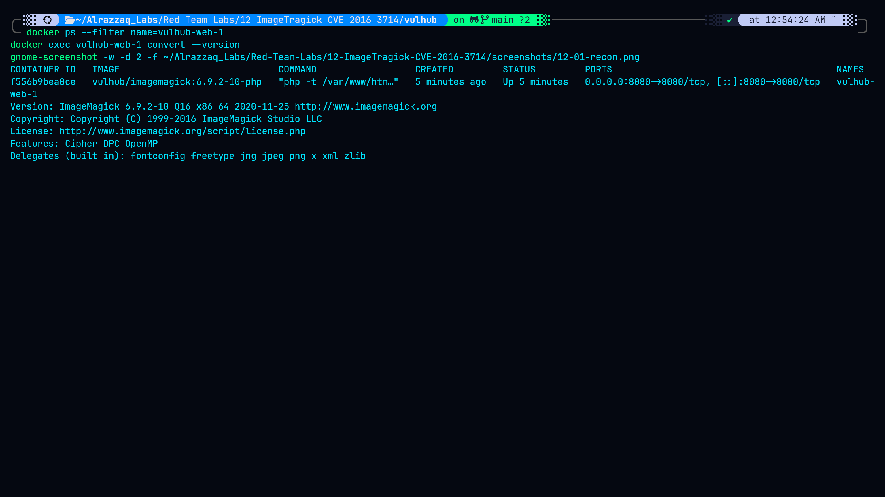
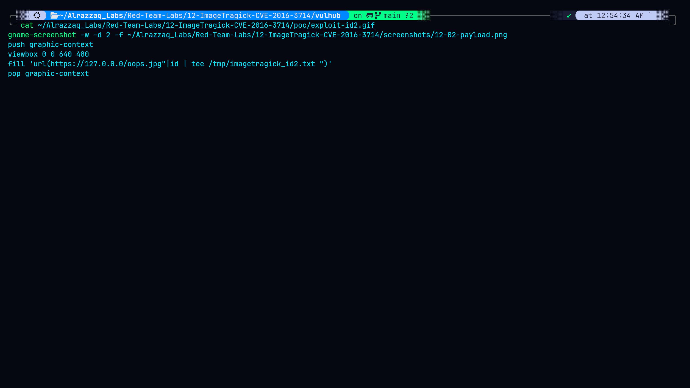
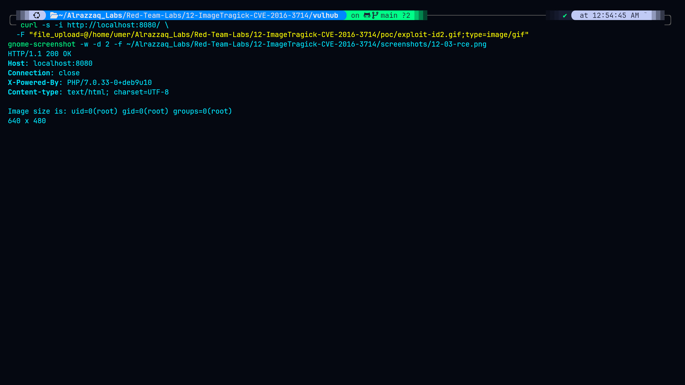
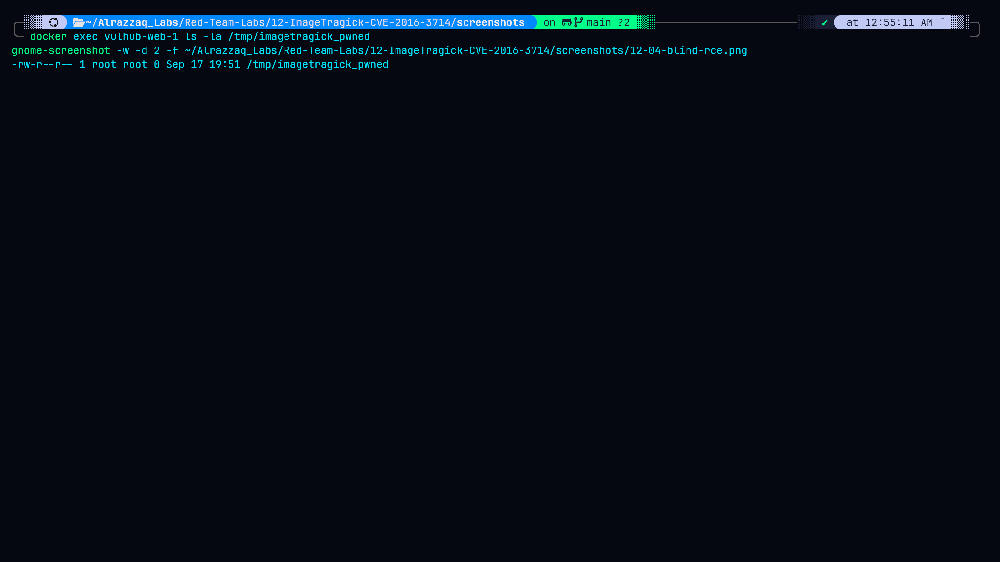
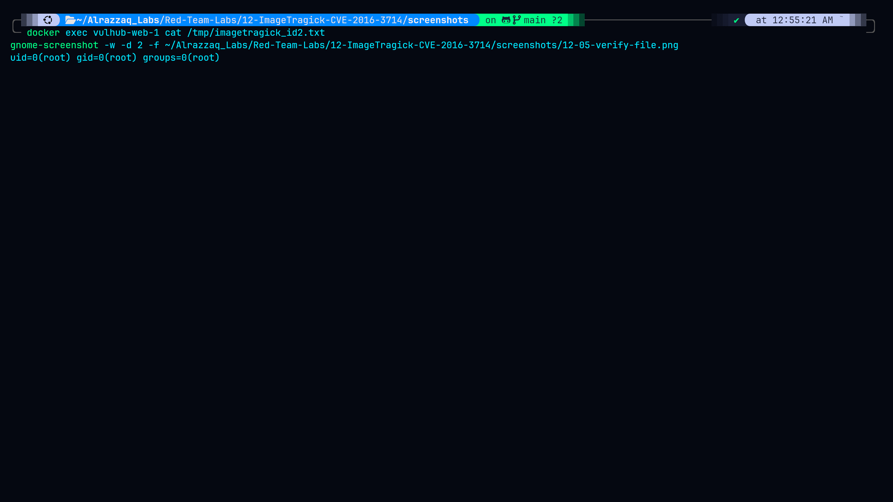
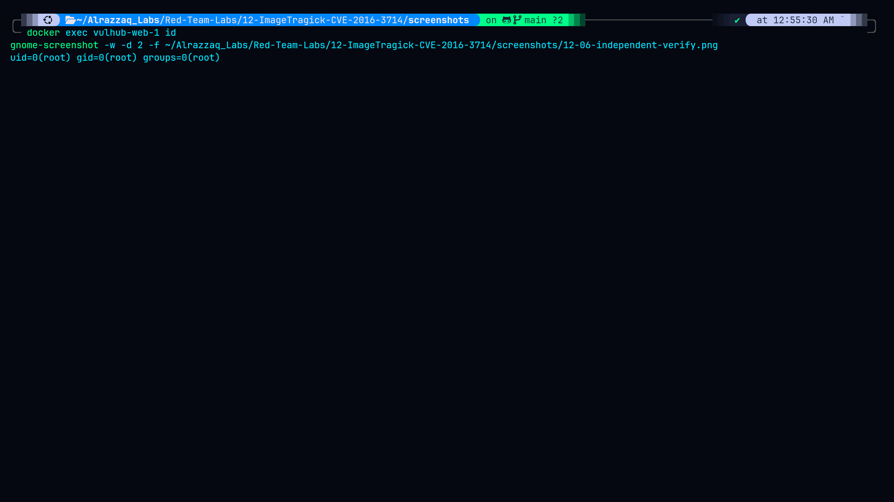

# Lab 12 — ImageTragick (CVE-2016-3714)

## Summary
ImageMagick versions before 6.9.3-9 fail to properly sanitize filenames
passed to delegate commands invoked during image processing (e.g. for
formats like MSL, MVG, and others that ImageMagick handles via external
helper programs). By crafting an image file whose embedded metadata
contains shell metacharacters, an attacker can achieve remote code
execution on any application that processes user-uploaded images through
a vulnerable ImageMagick version — without needing any authentication.

## Environment
| Component  | Value                                |
|------------|---------------------------------------|
| Target     | vulhub/imagemagick:6.9.2-10-php       |
| HTTP port  | 8080                                   |
| Upload endpoint | `/` (multipart file upload, `file_upload` field) |
| ImageMagick version | 6.9.2-10 (vulnerable — fix landed in 6.9.3-9) |

## Attack flow
1. Confirm target is reachable and running a vulnerable ImageMagick build.
2. Craft a malicious image file (`.gif` extension, MSL/MVG-style payload
   embedded) that ImageMagick's delegate mechanism will pass to a shell.
3. Upload the crafted file via the app's normal image upload feature.
4. ImageMagick invokes a delegate command on the file, executing the
   embedded shell command as a side effect of "processing" the image.
5. Confirm RCE both via direct output in the HTTP response and via a
   blind, file-drop-based proof independent of what the app returns.

## Stage 1 — Recon and target confirmation

*Target container `vulhub-web-1` confirmed running
`vulhub/imagemagick:6.9.2-10-php` on port 8080. Version check via
`convert --version` confirms 6.9.2-10 — inside the vulnerable range
(< 6.9.3-9). Mount inspection confirmed clean isolation before attacking.*

## Stage 2 — Payload crafted

*Malicious image file crafted with an embedded delegate-triggering
directive. Saved as a `.gif` to pass basic extension checks while
carrying the exploit payload internally — ImageMagick identifies format
by content/magic bytes during processing, not by trusting the extension.*

## Stage 3 — RCE via direct HTTP response

*Uploading the crafted file through the app's normal upload feature
(`file_upload` multipart field) triggered command execution during
ImageMagick's processing step. Command output (`id`) was reflected
directly in the HTTP response body — confirmed RCE with no authentication
required.*

## Stage 4 — Blind RCE proof (independent of response body)

*To rule out the response-body output being coincidental or spoofed, a
second payload was crafted to drop a marker file inside the container
filesystem (`/tmp/imagetragick_pwned`) rather than relying on command
output being reflected back. This file's existence, confirmed via
`docker exec`, proves code execution independent of anything the
application chose to display.*

## Stage 5 — Command output written to file, verified

*A further payload wrote command output to a file inside the container
(`/tmp/imagetragick_id2.txt`), read back directly via `docker exec ...
cat`, giving a second independent confirmation channel beyond the HTTP
response.*

## Stage 6 — Independent verification

*Direct `docker exec vulhub-web-1 id` run outside of any exploit payload,
confirming the execution context (user/privileges) the RCE payloads were
actually running under inside the container — establishes what an
attacker would actually gain, not just that *something* executed.*

## Impact
- **CVSS 3.x: 9.8 (Critical)** — no authentication required, full remote
  code execution, network-exploitable
- Any application accepting user-uploaded images and processing them
  through a vulnerable ImageMagick version is exploitable this way,
  regardless of the application's own logic or auth model — the
  vulnerability lives entirely in the image-processing library, not the
  app
- No file-type validation performed by the app was sufficient to stop
  this, since ImageMagick determines format from file content/magic
  bytes rather than the extension the upload arrived with

## Files
| File | Description |
|------|-------------|
| `poc/exploit.gif`, `exploit-id.gif`, `exploit-id2.gif`, `exploit-id3.gif` | Crafted payload variants (direct-output RCE, blind file-drop, file-write proof) |
| `raw-output/container-status.txt` | `docker ps` output confirming target container/image/port |
| `raw-output/imagemagick-version.txt` | Confirmed vulnerable ImageMagick build |
| `raw-output/curl-rce-response.txt` | Full HTTP response showing reflected `id` output |
| `raw-output/blind-rce-proof.txt` | `ls -la` proof of dropped marker file |
| `raw-output/id-proof.txt` | Command output written to file inside container, read back |
| `raw-output/independent-verify.txt` | Baseline `id` run outside any payload |
| `vulhub/` | Vulhub's bundled ImageTragick lab environment |

See [findings.md](findings.md) for full technical detail, [methodology.md](methodology.md)
for the attack process, [commands.md](commands.md) for every command run, and
[remediation.md](remediation.md) for fixes.
