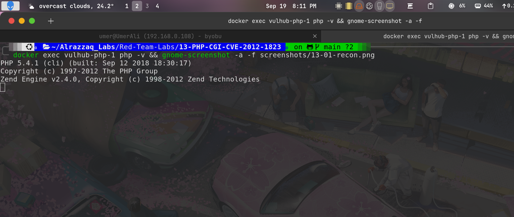
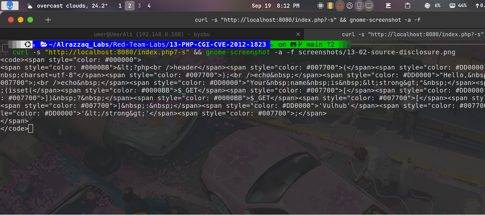
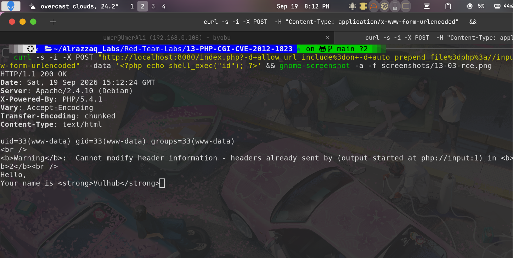
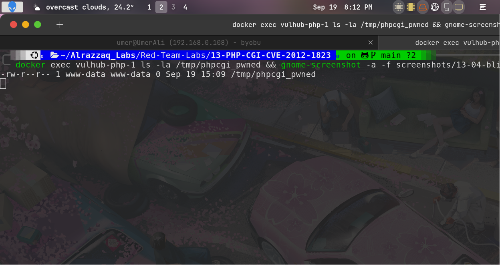
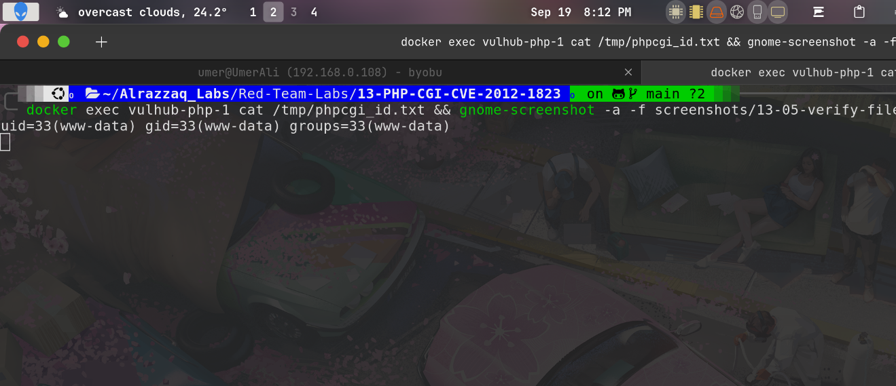
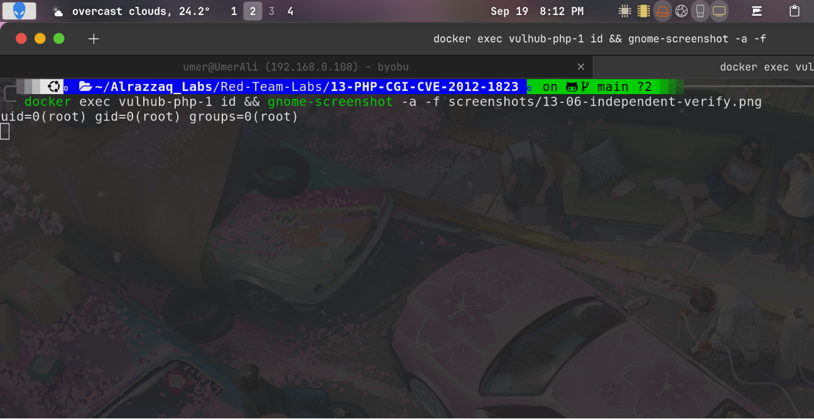

# Lab 13 — PHP-CGI Argument Injection (CVE-2012-1823)

## Summary
PHP versions before 5.3.12/5.4.2, when run via PHP-CGI (not mod_php or
PHP-FPM), fail to properly handle query strings that don't contain an
unencoded `=` character. Per RFC 3875, such query strings should be passed
as CGI command-line parameters — but PHP-CGI mishandles this, allowing an
attacker to inject arbitrary php.ini directives directly through the URL.
Combined with `auto_prepend_file=php://input`, this allows unauthenticated
remote code execution by having PHP execute the raw POST body as PHP code
before running the actual script.

## Environment
| Component  | Value                              |
|------------|---------------------------------------|
| Target     | vulhub/php:5.4.1-cgi                |
| HTTP port  | 8080                                  |
| Endpoint   | `/index.php`                          |
| PHP version | 5.4.1 (vulnerable — fix in 5.3.12 / 5.4.2) |

## Attack flow
1. Confirm target is reachable and running a vulnerable PHP-CGI version.
2. Confirm the bug exists using the low-impact `-s` flag (source disclosure).
3. Escalate to full RCE using `-d allow_url_include=on -d
   auto_prepend_file=php://input`, sending PHP code in the POST body.
4. Verify RCE via direct response output, then independently via
   file-drop and file-write proofs inside the container.

## Stage 1 — Recon and target confirmation

*Target container `vulhub-php-1` confirmed running PHP 5.4.1 via PHP-CGI
— inside the vulnerable range (< 5.3.12 / < 5.4.2). HTTP 200 confirmed
reachable, mount isolation confirmed clean before attacking.*

## Stage 2 — Source disclosure (vulnerability confirmation)

*Requesting `/index.php?-s` caused PHP-CGI to interpret the bare `-s` flag
as a command-line argument rather than form data, per the RFC 3875
handling flaw — returning the application's raw PHP source instead of
executing it. This confirms the query-string-as-CLI-argument
vulnerability exists before attempting code execution.*

## Stage 3 — RCE via direct HTTP response

*A POST request to `/index.php?-d+allow_url_include%3don+-d+auto_prepend_file%3dphp%3a//input`
with `<?php echo shell_exec("id"); ?>` as the body caused PHP to execute
the POST data as PHP code before the real script ran. Command output
(`uid=33(www-data) gid=33(www-data) groups=33(www-data)`) was reflected
directly in the HTTP response — confirmed unauthenticated RCE.*

## Stage 4 — Blind RCE proof (independent of response body)

*A second payload created a marker file
(`/tmp/phpcgi_pwned`) inside the container rather than relying on response
content. Its existence, confirmed via `docker exec ... ls -la`, proves
code execution independent of anything the application response
displayed.*

## Stage 5 — Command output written to file, verified

*A further payload wrote `id` output to a file inside the container
(`/tmp/phpcgi_id.txt`), read back directly via `docker exec ... cat`,
giving a second independent confirmation channel.*

## Stage 6 — Independent verification and execution context

*Baseline `docker exec vulhub-php-1 id` (outside any payload) shows
`uid=0(root)` — this is the container's exec context, not the web
server's. The actual RCE payloads (Stages 3–5) confirm the PHP-CGI
process itself runs as `www-data`, not root — an important distinction
for accurately scoping impact.*

## Impact
- **CVSS 3.x: 9.8 (Critical)** — no authentication required,
  network-exploitable, full remote code execution
- Execution occurs in the **`www-data`** context, not root — real-world
  impact depends on what `www-data` can reach (other app secrets,
  internal network access, writable paths), not full host compromise by
  default
- Any deployment running PHP as CGI (rather than mod_php/FPM) with an
  affected PHP version is exploitable regardless of the application's
  own code, since the flaw is in PHP-CGI's argument parsing, not in
  application logic

## Files
| File | Description |
|------|-------------|
| `raw-output/source-disclosure.txt` | PHP source leaked via `-s` flag |
| `raw-output/rce-response.txt` | Full HTTP response with `id` output reflected |
| `raw-output/blind-rce-proof.txt` | `ls -la` proof of dropped marker file |
| `raw-output/id-proof.txt` | Command output written to file inside container, read back |
| `raw-output/independent-verify.txt` | Baseline `id` run outside any payload |
| `raw-output/container-status.txt` | `docker ps` confirming target container/image/port |
| `raw-output/php-version.txt` | Confirmed vulnerable PHP-CGI build |
| `vulhub/` | Vulhub's bundled PHP-CGI lab environment |

See [findings.md](findings.md) for full technical detail, [methodology.md](methodology.md)
for the attack process, [commands.md](commands.md) for every command run, and
[remediation.md](remediation.md) for fixes.
