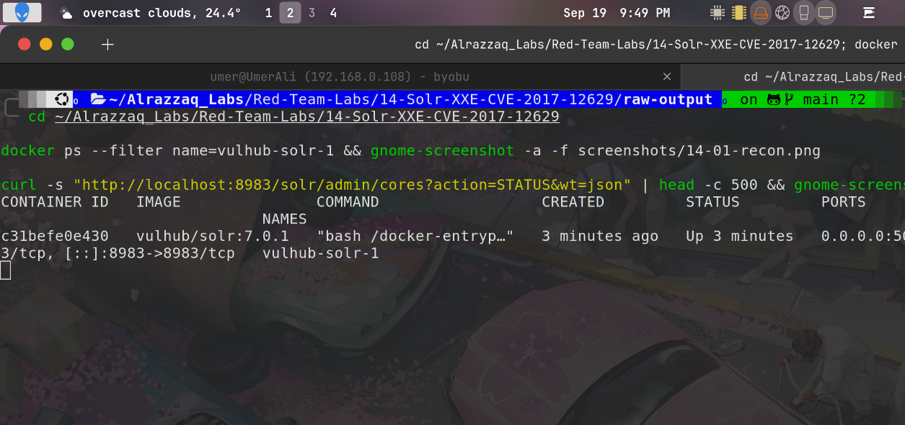
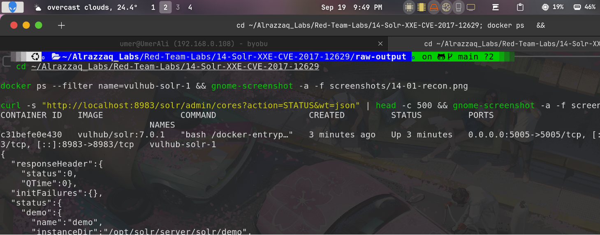
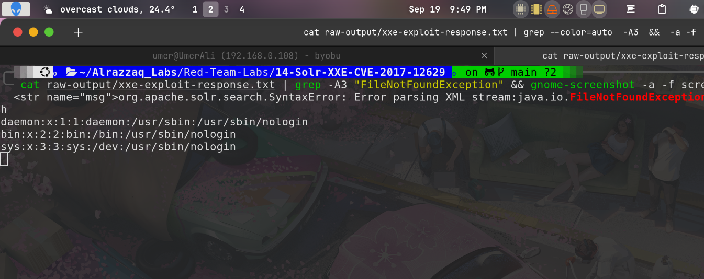
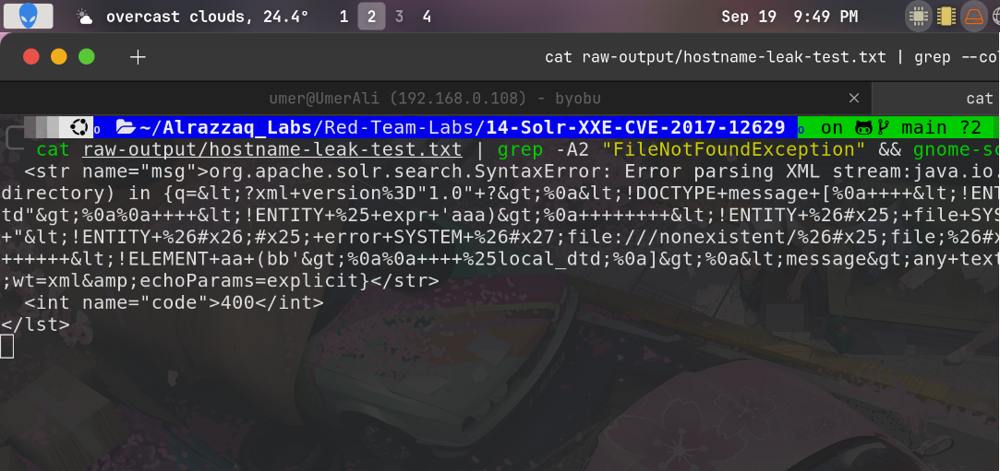

# Lab 14 — Apache Solr XML External Entity Injection (CVE-2017-12629)

## Summary
Apache Solr versions before 7.1.0 parse XML search queries (`defType=xmlparser`)
without disabling external entity resolution, allowing an XML External Entity
(XXE) injection. Since Solr's response doesn't echo back injected entity
content directly, this is a **Blind XXE** — exploited here via **error-based
XXE**, a technique that smuggles file contents out through a deliberately
triggered parser error message rather than the response body itself.

## Environment
| Component  | Value                          |
|------------|---------------------------------|
| Target     | vulhub/solr:7.0.1               |
| HTTP port  | 8983                            |
| Endpoint   | `/solr/demo/select` (pre-configured `demo` core) |
| Solr version | 7.0.1 (vulnerable — fix in 7.1.0) |

## Attack flow
1. Confirm target is reachable and the `demo` core is available.
2. Confirm a suitable local DTD file exists inside the container
   (`fonts.dtd`, bundled with the openjdk base image) to support the
   error-based technique.
3. Craft an XXE payload that redefines an internal DTD parameter entity
   to smuggle a target file's contents into a deliberately broken file
   path, triggering a `FileNotFoundException` that leaks the file
   contents in its error message.
4. Confirm the technique generalizes by repeating it against a second,
   distinct file.

## Stage 1 — Recon and core confirmation

*Target container `vulhub-solr-1` confirmed running Solr 7.0.1 — inside
the vulnerable range (< 7.1.0). `fonts.dtd` confirmed present at
`/usr/share/xml/fontconfig/fonts.dtd`, satisfying the precondition for
the error-based XXE technique. Mount inspection confirmed clean
isolation.*

## Stage 2 — Core status confirmed

*Queried Solr's admin core-status endpoint and confirmed the `demo` core
is active and pre-configured — the exact core the vulnerable endpoint
(`/solr/demo/select`) depends on, ready to receive the crafted query
without needing manual core creation.*

## Stage 3 — Error-based XXE: `/etc/passwd` leaked

*Sent a crafted XML payload via `GET /solr/demo/select?wt=xml&defType=xmlparser&q=...`
that redefined an internal parameter entity from `fonts.dtd` to reference
`/etc/passwd`, then forced a lookup against a nonexistent path with the
file's content spliced in. Since Solr's response never echoes the XML
directly (confirming this is Blind XXE), the resulting
`FileNotFoundException` error message became the exfiltration channel —
the full contents of `/etc/passwd` are visible directly inside the Java
stack trace text.*

## Stage 4 — Technique generalization confirmed (`/etc/hostname`)

*To rule out the passwd leak being coincidental, the identical technique
was repeated against a different, much shorter target file
(`/etc/hostname`). The leaked value (`c31befe0e430`) was cross-checked
against the container ID reported by `docker ps` earlier in the lab and
matched exactly — independent confirmation that the exfiltration
technique generalizes to arbitrary file reads, not a fluke tied to one
specific file's content.*

## Impact
- **CVSS 3.x: 7.5 (High)** for the base XXE vulnerability — no
  authentication required, network-exploitable, arbitrary local file
  disclosure
- Because this is Blind XXE, naive testing (checking whether injected
  content is reflected) would miss the vulnerability entirely — the
  error-based technique demonstrated here is the difference between
  concluding "not exploitable" and actually extracting real file content
- CVE-2017-12629 also has a documented RCE variant when chained with
  Solr's other components (not exploited in this lab — see Vulhub's
  separate `CVE-2017-12629-RCE` environment for that chain)

## Files
| File | Description |
|------|-------------|
| `raw-output/core-status.txt` | Confirmed `demo` core active before exploitation |
| `raw-output/xxe-exploit-response.txt` | Full response with leaked `/etc/passwd` inside the parser error |
| `raw-output/hostname-leak-test.txt` | Second payload leaking `/etc/hostname`, confirming generalization |
| `raw-output/local-dtd-confirmation.txt` | Confirmed `fonts.dtd` present at the required path |
| `raw-output/container-status.txt` | `docker ps` confirming target container/image/port |
| `vulhub/` | Vulhub's bundled Solr XXE lab environment |

See [findings.md](findings.md) for full technical detail, [methodology.md](methodology.md)
for the attack process, [commands.md](commands.md) for every command run, and
[remediation.md](remediation.md) for fixes.
