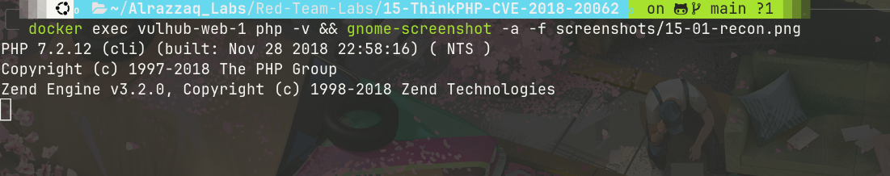
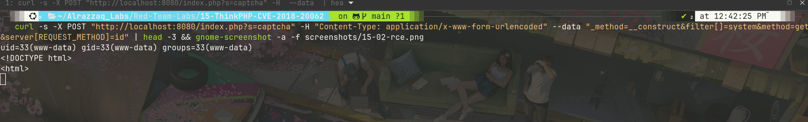
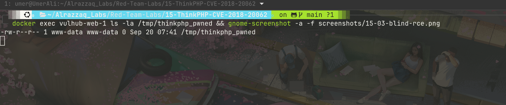
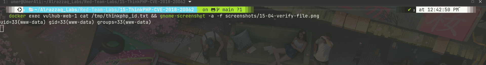
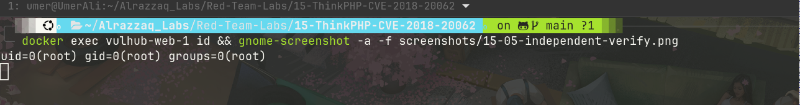

# Lab 15 — ThinkPHP 5.0.23 Remote Code Execution (CVE-2018-20062)

## Summary
ThinkPHP versions before 5.0.24 mishandle how the framework's `Request`
class determines its own request method, allowing an attacker to invoke
the class's `__construct` method with attacker-controlled parameters via
a crafted `_method` override. Combined with a `filter[]` value of
`system`, this routes the `REQUEST_METHOD` server variable through PHP's
`system()` function — achieving unauthenticated remote code execution.
This CVE remains on CISA's Known Exploited Vulnerabilities list and sees
tens of thousands of active exploitation attempts daily years after
disclosure.

## Environment
| Component  | Value                              |
|------------|---------------------------------------|
| Target     | vulhub/thinkphp:5.0.23              |
| HTTP port  | 8080                                  |
| Endpoint   | `/index.php?s=captcha`                |
| PHP version | 7.2.12                              |
| ThinkPHP version | 5.0.23 (vulnerable — fix in 5.0.24) |

## Attack flow
1. Confirm target is reachable and running a vulnerable ThinkPHP version.
2. Send a crafted POST request abusing `_method=__construct` to call the
   `Request` class constructor with a `filter[]=system` parameter,
   causing the framework to pass `REQUEST_METHOD` through `system()`.
3. Verify RCE via direct response output, then independently via
   file-drop and file-write proofs inside the container.

## Stage 1 — Recon and target confirmation

*Target container `vulhub-web-1` confirmed running ThinkPHP 5.0.23 on
PHP 7.2.12 — inside the vulnerable range (< 5.0.24). HTTP 200 confirmed
reachable, mount isolation confirmed clean before attacking.*

## Stage 2 — RCE via direct HTTP response

*A POST request to `/index.php?s=captcha` with body
`_method=__construct&filter[]=system&method=get&server[REQUEST_METHOD]=id`
caused the `Request` class constructor to route the `REQUEST_METHOD`
value through `system()`. Command output
(`uid=33(www-data) gid=33(www-data) groups=33(www-data)`) appeared
directly at the top of the response, immediately followed by ThinkPHP's
own framework error page — the exception thrown after execution is
expected behavior for this technique, not a failure.*

## Stage 3 — Blind RCE proof (independent of response body)

*A second payload created a marker file
(`/tmp/thinkphp_pwned`) inside the container rather than relying on
response content. Its existence, confirmed via `docker exec ... ls -la`,
proves code execution independent of anything the application response
displayed.*

## Stage 4 — Command output written to file, verified

*A further payload wrote `id` output to a file inside the container
(`/tmp/thinkphp_id.txt`), read back directly via `docker exec ... cat`,
giving a second independent confirmation channel.*

## Stage 5 — Independent verification and execution context

*Baseline `docker exec vulhub-web-1 id` (outside any payload) shows
`uid=0(root)` — this is the container's exec context, not the web
server's. The actual RCE payloads (Stages 2–4) confirm the PHP process
itself runs as `www-data`, not root — the same distinction observed in
Lab 13 (PHP-CGI), correctly scoping real-world impact.*

## Impact
- **CVSS 3.x: 9.8 (Critical)** — no authentication required,
  network-exploitable, full remote code execution
- Actively exploited in the wild at massive scale years after
  disclosure — FortiGuard Labs reported over 50,000 exploitation attempts
  per day as of 2023, and this CVE remains on CISA's Known Exploited
  Vulnerabilities catalog
- Execution occurs in the `www-data` context, not root by default —
  real-world impact depends on what that context can reach
- ThinkPHP is extremely widely deployed (particularly in Chinese web
  hosting environments), making this one of the most consequential
  entries in this lab series in terms of real-world exposure

## Files
| File | Description |
|------|-------------|
| `raw-output/rce-response.txt` | Full HTTP response with `id` output reflected before the framework error page |
| `raw-output/blind-rce-proof.txt` | `ls -la` proof of dropped marker file |
| `raw-output/id-proof.txt` | Command output written to file inside container, read back |
| `raw-output/independent-verify.txt` | Baseline `id` run outside any payload |
| `raw-output/container-status.txt` | `docker ps` confirming target container/image/port |
| `raw-output/php-version.txt` | Confirmed PHP version in use |
| `vulhub/` | Vulhub's bundled ThinkPHP 5.0.23 lab environment |

See [findings.md](findings.md) for full technical detail, [methodology.md](methodology.md)
for the attack process, [commands.md](commands.md) for every command run, and
[remediation.md](remediation.md) for fixes.
