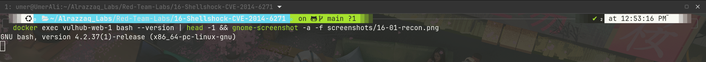
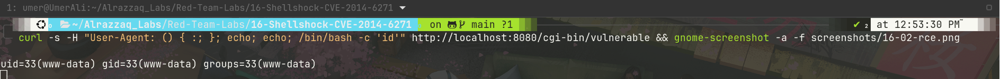
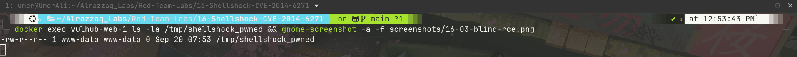
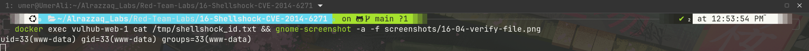
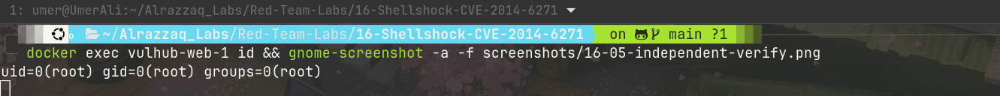

# Lab 16 — Shellshock (CVE-2014-6271)

## Summary
Bash versions before the September 2014 patch fail to stop parsing after
a function definition stored in an environment variable. Instead of
halting at the closing `}` of the function body, Bash continues
executing any additional shell commands appended after it. Since CGI
scripts pass HTTP headers (such as `User-Agent`) directly into
environment variables, an attacker can smuggle a malicious function
definition followed by arbitrary shell commands into a request header —
achieving unauthenticated remote code execution the moment Bash
processes that environment variable during CGI script invocation.

## Environment
| Component  | Value                              |
|------------|---------------------------------------|
| Target     | vulnerables/cve-2014-6271            |
| HTTP port  | 8080                                   |
| Endpoint   | `/cgi-bin/vulnerable`                  |
| Bash version | 4.2.37(1)-release (vulnerable)       |

## Attack flow
1. Confirm target is reachable and running a vulnerable Bash version.
2. Confirm the vulnerable CGI endpoint responds normally to a benign request.
3. Send a crafted `User-Agent` header containing a Shellshock payload,
   exploiting Bash's function-parsing flaw to execute arbitrary commands.
4. Verify RCE via direct response output, then independently via
   file-drop and file-write proofs inside the container.

## Stage 1 — Recon and target confirmation

*Target container `vulhub-web-1` confirmed running Bash 4.2.37(1)-release
— inside the vulnerable range (pre-patch). HTTP 200 confirmed reachable
on both the main page and the vulnerable CGI endpoint, mount isolation
confirmed clean before attacking.*

## Stage 2 — RCE via direct HTTP response

*A request to `/cgi-bin/vulnerable` with header
`User-Agent: () { :; }; echo; echo; /bin/bash -c 'id'` exploited Bash's
function-parsing flaw: the `() { :; };` portion parses as a harmless
empty function definition, but Bash's bug causes it to continue
executing everything after the semicolon as a live shell command.
Command output (`uid=33(www-data) gid=33(www-data) groups=33(www-data)`)
was reflected directly in the HTTP response — confirmed unauthenticated
RCE via a single crafted header.*

## Stage 3 — Blind RCE proof (independent of response body)

*A second payload created a marker file (`/tmp/shellshock_pwned`) inside
the container rather than relying on response content. Its existence,
confirmed via `docker exec ... ls -la`, proves code execution
independent of anything the application response displayed.*

## Stage 4 — Command output written to file, verified

*A further payload wrote `id` output to a file inside the container
(`/tmp/shellshock_id.txt`), read back directly via `docker exec ...
cat`, giving a second independent confirmation channel.*

## Stage 5 — Independent verification and execution context

*Baseline `docker exec vulhub-web-1 id` (outside any payload) shows
`uid=0(root)` — this is the container's exec context, not the web
server's. The actual RCE payloads (Stages 2–4) confirm the CGI/Bash
process runs as `www-data`, not root — the same execution-context
distinction observed across this lab series (Labs 12, 13, 15).*

## Impact
- **CVSS 3.x: 9.8 (Critical)** — no authentication required,
  network-exploitable, full remote code execution
- One of the most historically significant vulnerabilities in this
  series — disclosed in 2014, affecting an enormous share of
  internet-facing Linux/Unix systems at the time due to Bash's
  ubiquity as the default shell invoked by CGI, DHCP clients, SSH
  restricted shells, and numerous other services beyond just web servers
- Execution occurs in the `www-data` context here (CGI-invoked), though
  this vulnerability class has affected non-web attack surfaces too
  (e.g. DHCP client scripts, OpenSSH `ForceCommand` restricted shells)
  depending on how Bash is invoked

## Files
| File | Description |
|------|-------------|
| `raw-output/rce-response.txt` | Full HTTP response with `id` output reflected |
| `raw-output/blind-rce-proof.txt` | `ls -la` proof of dropped marker file |
| `raw-output/id-proof.txt` | Command output written to file inside container, read back |
| `raw-output/independent-verify.txt` | Baseline `id` run outside any payload |
| `raw-output/bash-version.txt` | Confirmed vulnerable Bash version |
| `raw-output/container-status.txt` | `docker ps` confirming target container/image/port |
| `vulhub/docker-compose.yml` | Custom compose file wrapping the standalone `vulnerables/cve-2014-6271` image |

See [findings.md](findings.md) for full technical detail, [methodology.md](methodology.md)
for the attack process, [commands.md](commands.md) for every command run, and
[remediation.md](remediation.md) for fixes.
