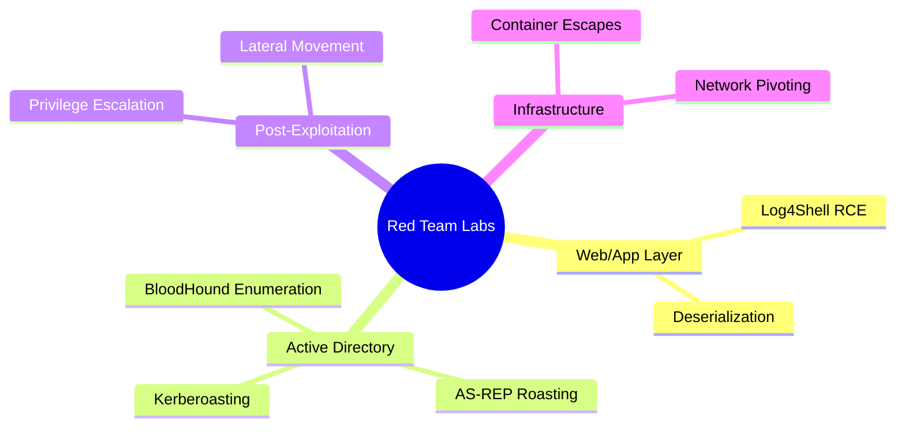
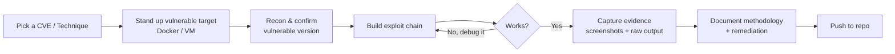

 

---

## What This Is

A collection of **self-hosted, fully reproducible exploitation labs** — each one takes a real CVE
or attack technique from zero to confirmed impact, documented end-to-end: recon, exploit chain,
every bug hit along the way, and remediation. No copy-pasted exploit scripts without understanding
them — every lab here was built, broken, debugged, and fixed by hand.

---

## Lab Index

| # | Lab | CVE / Technique | Status | Impact |
|---|---|---|:---:|---|
| 01 | [Log4Shell — Apache Solr RCE](./01-Log4Shell-CVE-2021-44228) | CVE-2021-44228 | ✅ Complete | Remote Code Execution (root) |
| 02 | [Spring4Shell — Tomcat/Spring MVC RCE](./02-Spring4Shell-CVE-2022-22965) | CVE-2022-22965 | ✅ Complete | Remote Code Execution (root) |
| 03 | [Fastjson — JSON Deserialization RCE](./03-Fastjson-CVE-2017-18349) | CVE-2017-18349 | ✅ Complete | Remote Code Execution (root) |
| 04 | [Struts2 — S2-045 RCE](./04-Struts2-S2-045-CVE-2017-5638) | CVE-2017-5638 | ✅ Complete | Remote Code Execution (root) |
| 05 | [Drupalgeddon2 — Drupal RCE](./05-Drupalgeddon2-CVE-2018-7600) | CVE-2018-7600 | ✅ Complete | Remote Code Execution (root) |

> Each lab folder is self-contained: `README.md` (full writeup), `screenshots/` (visual evidence),
> `raw-output/` (unedited terminal logs), and any PoC code used.

---

## Attack Surface Covered So Far

---

## How a Lab Is Built

Every lab documents the **real debugging path** — tooling quirks, networking gotchas, version
mismatches — not just the clean happy-path exploit. That's usually where the actual learning is.

---

## Methodology

Each lab follows the same structure for consistency:

1. **Recon** — identify the vulnerable component and confirm exploitability
2. **Isolation Check** — verify blast radius before touching anything (host mounts, network scope)
3. **Injection / Exploitation** — build and fire the actual exploit chain
4. **Evidence** — screenshots + raw terminal output, unedited
5. **Remediation** — how the vulnerability is actually fixed in production

---

## Environment

All labs run **fully self-hosted** — no cloud infrastructure, no shared targets. Vulnerable
services are containerized (Vulhub) or run as isolated KVM/libvirt VMs, with network isolation
verified before any exploitation begins.

---

## Disclaimer

> Every lab in this repository is performed against **deliberately vulnerable, self-hosted
> targets** on an isolated local network, for educational purposes only. No production systems,
> third-party infrastructure, or external targets are involved in any exercise documented here.

---

**⭐ More labs added as they're completed — check the index above for progress.**

