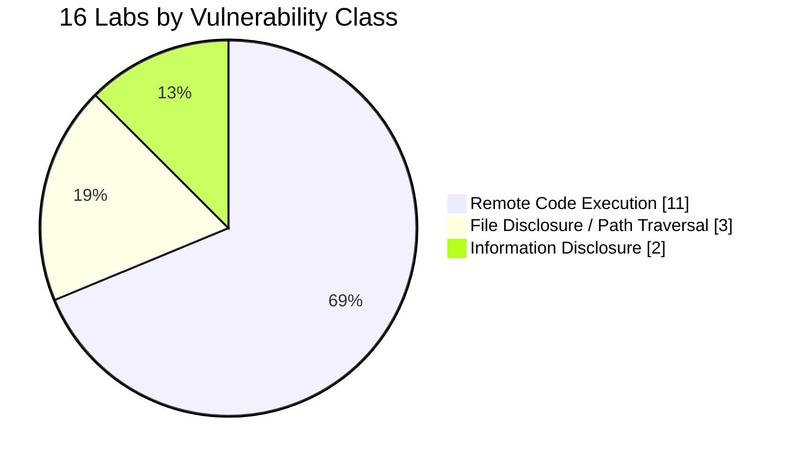
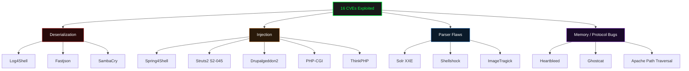
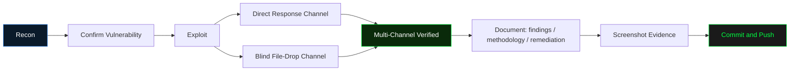
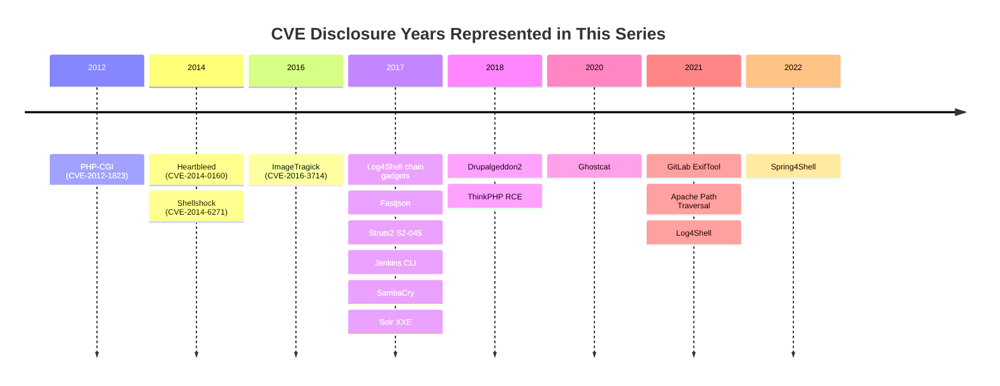

**A hands-on offensive security lab series — each entry is a fully exploited, evidenced, and documented CVE.**
Every lab includes a full writeup, raw command output, and screenshot evidence for every stage of exploitation.

---

## 📊 Lab Index

| # | Lab | CVE / Technique | Status | Impact |
|---|-----|------------------|--------|--------|
| 01 | [Log4Shell — Apache Solr RCE](01-Log4Shell-CVE-2021-44228) | `CVE-2021-44228` | ✅ | 🔴 RCE (root) |
| 02 | [Spring4Shell — Tomcat/Spring MVC RCE](02-Spring4Shell-CVE-2022-22965) | `CVE-2022-22965` | ✅ | 🔴 RCE (root) |
| 03 | [Fastjson — JSON Deserialization RCE](03-Fastjson-CVE-2017-18349) | `CVE-2017-18349` | ✅ | 🔴 RCE (root) |
| 04 | [Struts2 — S2-045 RCE](04-Struts2-S2-045-CVE-2017-5638) | `CVE-2017-5638` | ✅ | 🔴 RCE (root) |
| 05 | [Drupalgeddon2 — Drupal RCE](05-Drupalgeddon2-CVE-2018-7600) | `CVE-2018-7600` | ✅ | 🔴 RCE (root) |
| 06 | [Ghostcat — Tomcat AJP File Read/RCE](06-Ghostcat-CVE-2020-1938) | `CVE-2020-1938` | ✅ | 🟠 File Read / RCE |
| 07 | [Jenkins — CLI Arbitrary File Read/RCE](07-Jenkins-CVE-2017-1000353) | `CVE-2017-1000353` | ✅ | 🟠 File Read / RCE |
| 08 | [GitLab — ExifTool Pre-Auth RCE](08-GitLab-CVE-2021-22205) | `CVE-2021-22205` | ✅ | 🔴 RCE (git) |
| 09 | [SambaCry — Samba RCE](09-SambaCry-CVE-2017-7494) | `CVE-2017-7494` | ✅ | 🔴 RCE |
| 10 | [Apache Path Traversal + RCE](10-Apache-CVE-2021-41773) | `CVE-2021-41773` / `CVE-2021-42013` | ✅ | 🔴 File Disclosure + RCE |
| 11 | [Heartbleed — OpenSSL Info Disclosure](11-Heartbleed-CVE-2014-0160) | `CVE-2014-0160` | ✅ | 🟡 Info Disclosure (RSA key recovered) |
| 12 | [ImageTragick — ImageMagick RCE](12-ImageTragick-CVE-2016-3714) | `CVE-2016-3714` | ✅ | 🔴 RCE (unauthenticated) |
| 13 | [PHP-CGI — Argument Injection RCE](13-PHP-CGI-CVE-2012-1823) | `CVE-2012-1823` | ✅ | 🔴 RCE (unauthenticated) |
| 14 | [Apache Solr — XXE Info Disclosure](14-Solr-XXE-CVE-2017-12629) | `CVE-2017-12629` | ✅ | 🟡 Arbitrary File Disclosure (Blind XXE) |
| 15 | [ThinkPHP — Argument Construct RCE](15-ThinkPHP-CVE-2018-20062) | `CVE-2018-20062` | ✅ | 🔴 RCE (unauthenticated, **CISA KEV**) |
| 16 | [Shellshock — Bash Function Parsing RCE](16-Shellshock-CVE-2014-6271) | `CVE-2014-6271` | ✅ | 🔴 RCE (unauthenticated) |

🔴 Critical/RCE &nbsp;&nbsp; 🟠 High (File Disclosure/RCE) &nbsp;&nbsp; 🟡 Medium-High (Info Disclosure)

---

## 📈 Vulnerability Class Breakdown

## 🌳 Labs by Root Cause

## 🔁 Exploitation Methodology

## 📅 Severity Timeline (by CVE disclosure year)

---

<b>🗂️ Browse by category</b> (click to expand)

 

### Remote Code Execution
[Log4Shell](01-Log4Shell-CVE-2021-44228) · [Spring4Shell](02-Spring4Shell-CVE-2022-22965) · [Fastjson](03-Fastjson-CVE-2017-18349) · [Struts2 S2-045](04-Struts2-S2-045-CVE-2017-5638) · [Drupalgeddon2](05-Drupalgeddon2-CVE-2018-7600) · [GitLab ExifTool](08-GitLab-CVE-2021-22205) · [SambaCry](09-SambaCry-CVE-2017-7494) · [ImageTragick](12-ImageTragick-CVE-2016-3714) · [PHP-CGI](13-PHP-CGI-CVE-2012-1823) · [ThinkPHP](15-ThinkPHP-CVE-2018-20062) · [Shellshock](16-Shellshock-CVE-2014-6271)

### File Disclosure / Path Traversal
[Ghostcat](06-Ghostcat-CVE-2020-1938) · [Jenkins CLI](07-Jenkins-CVE-2017-1000353) · [Apache Path Traversal](10-Apache-CVE-2021-41773)

### Information Disclosure
[Heartbleed](11-Heartbleed-CVE-2014-0160) — includes full RSA private key recovery
[Apache Solr XXE](14-Solr-XXE-CVE-2017-12629) — blind XXE via error-based exfiltration

---

## 📁 Lab Structure

Each lab folder is self-contained:
- `README.md` — full writeup with stages, screenshots, and impact analysis
- `findings.md` — numbered findings with severity ratings
- `methodology.md` — step-by-step attack process and reasoning
- `remediation.md` — fixes and defense-in-depth recommendations
- `commands.md` — every command run, for full reproducibility
- `screenshots/` — visual evidence for every exploitation stage
- `raw-output/` — captured command/HTTP output backing every claim
- `vulhub/` — the Docker-based vulnerable environment used

Every RCE finding is verified through **at least two independent channels** (e.g. direct response output *and* an out-of-band file-drop confirmed via `docker exec`) — never relying solely on what the application chooses to display back.

---

⚠️ **All targets are intentionally vulnerable Docker environments (Vulhub / purpose-built images), run in isolated local containers for educational research only.**

